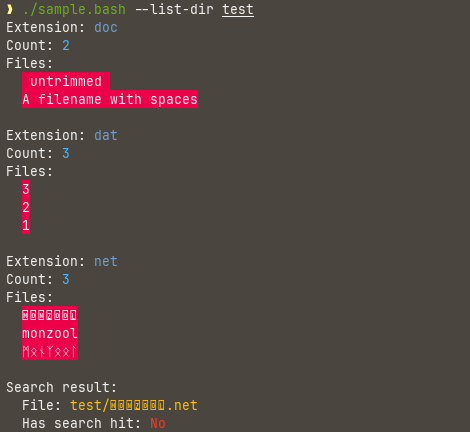
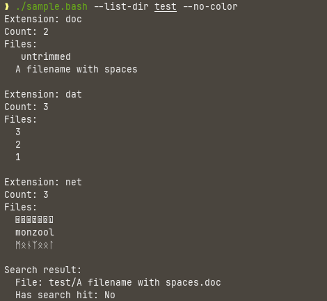
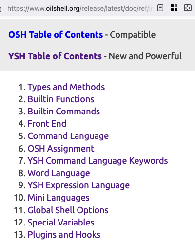

---

title: A Second Search for Bash Scripting Alternatives
post_date: 2024-07-13 09:23:44

---

<h1 style="color:DodgerBlue;">
A second search for bash scripting alternatives
</h1>

SHELL SCRIPTING IS something most programmers will encounter often - especially if doing dev-ops, automation and general Linux work. Unfortunately we are mostly stuck with bash. There surely must be better alternatives...

I have been in search for a bash replacement [before](https://monzool.net/blog/2017/07/04/a-search-for-bash-scripting-alternatives/#finalists). My conclusions was that I would try out: [scsh](https://scsh.net/), [luash](https://github.com/zserge/luash) and [mruby](https://mruby.org/). I'm addressing that experience in Addendum [Take 1](#addendum-take-1-anchor),

Since my last endeavor into finding a bash alternative, I've seen my work-life distance myself more and more from the small embedded devices, and move into higher level domains of JavaScript, Python and C#. In the environments where these run, the restrictions that apply to small embedded devices are not really applicable, and the options for scripting is much more open. Now I find myself back in the embedded world, and thus I figured it was time for another round of looking at bash alternatives. A lot of interesting stuff has happened in the programming language world these last years. That also include the scripting languages, where there seem to be a consensus that we might deserve more modern alternatives.


This post is available in two places

- On the monzool.net [blog](https://monzool.net/blog/2024/07/14/a-second-search-for-bash-scripting-alternatives/), for a pretty viewing.

- On [github](https://github.com/monzool/A-Search-for-BASH-Scripting-Alternatives) where the source code is also available. This post is the *Take2* part of this series (direct preview link here: [preview](https://github.com/monzool/A-Search-for-BASH-Scripting-Alternatives/blob/master/Take2/Take2.md))

---

<a name="approach-anchor"></a>
<h1 style="color:DodgerBlue;">
The approach
</h1>

In this post I will not sprinkle code examples to exemplify how each and individual language look, feel and have of specialties. Nor will I do a deep dive into each of them. I therefore encourage visiting each individual homepage of each language to make you own opinion.

What I **will** do, is to actually try out the language, instead of just do assumptions about them. 
For each language I will implement the same sample, that do the following:

1) **Change current directory to that of the script**. With bash scripts I sometimes change the current directory, to be the directory of the script. It depends, if this improves the user experience, or makes it worse. When the user have to provide paths as program arguments, is a bad idea. If the script requires to know the location of a lot of external files, is makes thing easier...
2) **Get program arguments from command-line**. I rarely do fancy stuff with options, but is a feature I use often. Basic support is fine
3) **Find files and get a list of found files**. Searching for files is paramount - but resorting to plain old `find` is perfectly fine, if the output is easy to grab.
4) **Split path, file name and file extension**. This requires string manipulation.
5) **Group files by extension**. This is best solved with dictionaries.
6) **Get a random number**. Not an essential feature (the operating system I use, have */dev/urandom*)
7) **Search a file for some text string**. This is probably my bread on butter use-case. It would actually benefit if this could be a call to `grep` (or `rg`) as these tools work perfectly for what they do.
8) **Pretty print in colors**. I am a heavy user of color printing. Its an easy way to bring focus on the essential parts.


A little introduction to this exercise. I first made a small sample script in bash. It takes to optional arguments. One that points to a directory of files, and another argument to possible disable color output

This is how the output looks in color



And with color suppression




The exercise is then to implement the equivalent in the other scripting languages, while **learning the language is I go**. I will be writing my thoughts and findings during the exercise, **including any doubts, misunderstandings and stupid mistakes**. I'm sure many will laugh of my struggles, but I think it will be a good exercise to get some indication on the difficulties learning the language for the average programmer. The eventual struggles I had, would probably also be the struggles of my colleagues. The friction of introducing a new language should be as little as possible.

Disclaimer: I will critique things here that someone or someones put their heart and soul into. This surely entail a risk that I unintentionally offend your favorite language, or even worse, a language that **you** created. Please be assured that I am not criticizing you personally or your work directly. In fact I am most likely just another idiot on the internet, ranting about stuff that I do not understand 😅. I for sure do not own the abilities to create such exiting stuff, so I salute you for your efforts and work 🙏


---

<a name="languages-anchor"></a>
<h1 style="color:DodgerBlue;">
Languages
</h1>

I am searching for a scripting language, that

- Have proper arrays and dictionaries
- Have versatile return values
- Do not have "everything is a string" syndrome
- Can call external programs and grab values and exit code from it
- Is low on cruft and boilerplate, but still readable
- Do not use dynamic scoping
- Is production ready
- Is not abandonware
- Is an actual interpreted language, where scripts can be edited on a remote target

Some of the languages also provide a shell. For the intended purpose, this is not important and bares no positive or negative impact, as long as the language can be used with another shell.

Documentation and examples weight in hard as a requirement, as otherwise guessing and confusion would entail and make the experience frustrating and unproductive - both for the writer and reviewer/reader.

Below is a list of languages in the pool for trying out. Each is marked with the following icons to indicate the level of application

📬 - have an implementation of the sample code \
📫 - attempted sample implementation \
📪 - no sample consdered \
🗑️ - not considered 


<h2 style="color:MediumVioletRed;">
Shells
</h2>

- [bash](#bash-anchor) 📬
- [elvish](#elvish-anchor) 📫
- [murex](#murex-anchor) 📫
- [ion](#ion-anchor) 📫
- [nushell](#nushell-anchor) 📬

<h2 style="color:MediumVioletRed;">
Shell scripting languages
</h2>

- [hush](#hush-anchor) 📬
- [koi](#koi-anchor) 📬
- [abs](#abs-anchor) 📬
- [ysh](#ysh-anchor) 📬

<h2 style="color:MediumVioletRed;">
Clojures
</h2>

- [Babashka](#babashka-anchor) 📪
- [Planck](#planck-anchor) 📪
- [Joker](#joker-anchor) 📪

<h2 style="color:MediumVioletRed;">
Lisps
</h2>

- [Fennel](#fennel-anchor) 📪
- [Janet](#janet-anchor) 📬

<h2 style="color:MediumVioletRed;">
Rejected contenders
</h2>

There are some really interesting languages out there that unfortunately do not fit within all parameters, regarding being applicable for a small embedded system.

- [elk](https://elk.strct.net/) 🗑️

  This is a tremendously interesting project. It looks very complete, versatile and pretty much check-marking all the [boxes](https://elk.strct.net/other/bash-literals.html) . There is just that issue that its a .NET 8 application and requires several hundreds of megabyte in memory and storage. There are some efforts in progress getting NativeAOT to cross-compile to [arm32](https://github.com/dotnet/runtime/issues/97729), but for now I do not consider it a viable contender

- [dart](https://dart.dev/) with [dlic](https://dcli.onepub.dev/) 🗑️

  dlic looks very interesting, and dart has a rumour of being very approachable. There is unfortunately a relatively high size and memory use if to be used as non-compiled scripts. [Hank G](https://www.nequalsonelifestyle.com/2021/12/13/dart-minimum-file-mem-and-run-time/) have some interesting measurements indicating up to 100 MB of memory usage for the runtime. If abandoning script interpretation and settle for complied programs, the resource usage can approach about a tenth of that.

- [gleam](https://gleam.run/) or [elixir](https://elixir-lang.org/) on [AtomVM](https://www.atomvm.net) 🗑️

  I've been making a few small projects in gleam. Its a interesting language and a very well driven project overall. The BEAM ecosystem is probably a bit on the bigger side. There is the AtomVM alternative, but it is unclear if gleam or elixir is able to run on that. Both are compiled languages, so they don't really fit the agenda anyway. \
  (P.S. consider doing like me, and [sponsor](https://github.com/sponsors/lpil) the amazing gleam project).

- [arsh](https://github.com/sekiguchi-nagisa/arsh)  🗑️

  [Appears](https://github.com/sekiguchi-nagisa/arsh/blob/master/sample/todo.ds) to be bash with types? The documentation is sadly pretty much non-existing.


<h2 style="color:MediumVioletRed;">
Future contenders
</h2>

For sure I have not depleted the realm of bash alternatives, so I am going to survey additional languages, either in this post or another. The addendum [Future candidates](addendum-future-candidates)
 has more details.


---

<br/>
<br/>

<a name="bash-anchor"></a>
<h1 style="color:DodgerBlue;">
bash
</h1>

<h2 style="color:MediumVioletRed;">
Sample
</h2>

The sample task is obvious to solve with a dictionary, where the key is the extension, and the values are a list of files that have that extension. Bash do have associative arrays, but do not support arrays of arrays. This puts on some limitations on how to construct the solution.

For each key (file extension) I serialize the list of files associated to that extension. 

```sh
file_list["${extension}"]+=$'\n'"${filename}"
```

When printing, I then deserialize to get the filenames back in entity form. 

```sh
deserialize_array() {
    local serialized="${1}"
    IFS=$'\n' read -r -d '' -a file_category <<< "${serialized}" || :
}
```

The implemented solution actually have a limitation, in that it does not support filenames with newlines, as `\n` is used as serializing separator (I did attempt to use `\0` as that is not a valid character in filenames, but I could not get that to work).  


For getting the file list, I've resorted to just use `find`. Now, bash could glob the files

```sh
for file in "${dir}"/**; do
    if [[ ! -f "${file}" ]]; then
        continue
    fi
    file_list+=( "${file}" )
done
```

but for this to work, then you need to remember to poke the shell options `shopt -p globstar` - and possibly remember to restore them again.... it gets complicated.

The sharp observer will notice that the `IFS` is temporarily poked for find files.

```sh
while IFS= read -r -d '' file; do
    file_list_all+=("${file}")
done < <(find "${dir}" -type f -print0)
```

Its a common technique prevent word splitting and pathname expansion... `IFS` is complicated

<h2 style="color:MediumVioletRed;">
Parsing program arguments
</h2>

Bash have [`getopts`](https://man7.org/linux/man-pages/man1/getopts.1p.html) builtin for parsing program argument. There is also [getpopt](https://www.man7.org/linux/man-pages/man1/getopt.1.html) for some additional features. I rarely use 'em. They both kinda suck, are both complicated and I can never remember how they work. A simple loop of case matching, is far sufficient for most of my situations

```sh
while [[ $# -gt 0 ]]; do
    case "$1" in
        --list-dir)
            option_list_dir="${2}"
            shift 2
            ;;
```


<h2 style="color:MediumVioletRed;">
Passing arguments to functions
</h2>

Passing arguments to bash functions are kind of old school. There are no parameter list, instead arguments are passed in to be referenced by a numeric index variable. First argument is `${1}`, second argument is `${2}` and so on. I'm used to it, but its kind of odd, come to think of it. There are various gotcha's when having values with spaces, but otherwise it works as expected... Except for associative arrays - then it gets complicated. Therefor I resorted to pass them as references

```sh
present_results() {
    declare -n extension_count_ref="${2}"
    declare -n file_list_ref="${3}"
```

It might come as a surprise that bash supports this kind of indirection, but bash is fully dynamic and quite powerful in that domain; but yeah, it gets complicated pretty fast. The terse syntax also does not make it easier to read later on 😅

<h2 style="color:MediumVioletRed;">
Returning values from functions
</h2>

Why even mention such a trivial matter as returning values from? Well in bash its... limited. We either return integer values or echo strings. Using `echo` to return strings, makes other printing complicated which, among other things, can make debugging hard. The basic string return, do let you set your own rules when in a script. It is for example possible to fake tuple like return values

```sh
get_tuple() {
    echo "Year|2024"
}

IFS='|' read -r message value <<< "$(get_tuple)"
```

But using such tricks, quite quickly make things get... complicated. Being bash there's lots of hacks to return other ways, but most have some footgun or another... it gets complicated. 

I do use the above mentioned trick sometimes, but over time I've mostly settled on a simpler principle: return zero or non-zero if to indicate success or fail, and if returning a value, put it in a global variable. This might sound chocking, but in practice it works quite fine.  

```sh
return_value=
get_return_value() {
    return_value="magic"
}
```

It do have its limitation in some corner cases (its a global variable after all), but its not much worse that bash's dynamic scoping anyway. What it certainly does is reducing complexity instead of loops and tricks and hacks to simulate proper return values. One key principal to limit the "pollution" of global variables, is then to never use the variable directly, except as arguments to other functions

```sh
use_return_value() {
    local value="${1}"
    echo "${value}"
}

use_return_value "${return_value}"
```

Theres a "How I Learned to _Stop_ Worrying and Love the *global return value*" blog post material lingering there. I'll probably never get there, so just keep calm and carry on 🫡

On an interesting note, then its possible to simulate named parameters in bash. However, I can testify its a submachine gun of a footgun, so I never do that anymore 😄 Speaking of footguns...

### Footguns

What does this snippet print?

```sh
get() {
    return false
}
get && echo success || echo fail
```

>return: false: numeric argument required

Below is how it is actually supposed to be:

```sh
get() {
    false
}
get && echo success || echo fail
```

That's just one footgun that I got hit by in the sample script. 

In an early incarnation of the sample script, this was how the line to increment the extension count looked like

```sh
(( extension_count["${extension}"]++ ))
```

At first glance this seems fine, but in fact it is not. It can be very puzzling, as the script will exit on that line. No error, just exit.

Inspecting the exit code, gives some indication

```sh
❱ echo $?
1
```

What happens is that lookup returns 0, then incrementing causes the overall expression to return non-zero, which then triggers `errexit`  🤦‍♀️

Lets just bypass `errexit` and override the non-zero with a NOP

```sh
(( extension_count["${extension}"]++ )) || :
```

Similar issue is the reason why the deserializer looks like this

```sh
deserialize_array() {
    local serialized="${1}"
    IFS=$'\n' read -r -d '' -a deserialized <<< "${serialized}" || :
}
```

In this configuration, `read` returns non-zero on EOF - which we will inevitable reach

The unofficial bash "safe" mode is not without its issues ❗

<br/>
<br/>

<a name="elvish-anchor"></a>
<h1 style="color:DodgerBlue;">
elvish
</h1>

[elvish](https://elv.sh)

<h2 style="color:MediumVioletRed;">
tl;dr
</h2>

Elvish is an amazing effort that just continues to improve, commit after commit, year after year. Unfortunately I decided to cut the sample short before completing it. I would have loved to say the documentation was awesome, but I spent way too much time on every single thing that I wanted to do.

vscode plugin: https://marketplace.visualstudio.com/items?itemName=elves.elvish

Shell: ✅ \
Approachable for a bash'er: ⭐☆☆☆☆ \
Enjoyment: ⭐☆☆☆☆


<h2 style="color:MediumVioletRed;">
Returning values from functions
</h2>

I browsed the entire [learn](https://elv.sh/learn/)section with no hint of how to return something from a function. I had to visit the reference to find an [example](https://elv.sh/ref/language.html#function) that used `echo` to return a string. 

In fact, the first thing that looks like a function was [this](https://elv.sh/learn/scripting-case-studies.html#update-servers-in-parallel.elv) example:

```
var hosts = [[&name=a &cmd='apt update']
             [&name=b &cmd='pacman -Syu']]
peach {|h| ssh root@$h[name] $h[cmd] } $hosts
```

The explanation was clear enough, so rolled my own edition

```elvish
say {|message| put $message} "Hello, world!"
```

But got this back
```error
Exception: exec: "say": executable file not found in $PATH
```

Oh. Not a function definition, but instead a command.
Lots of reading later I was able to put this together

```elvish
fn say {|message| put $message }
say "Hello, world!"
▶ 'Hello, world!'
```

As mentioned, a frustrating lot of reading was then required to figure out, how to make a function return stuff. Eventually I tumbled upon a tiny example that used `put` to return a value. It might be that I had some preconceived ideas on things, but I didn't expect elvish to rely on capturing printed stuff as return values. 

Finding the `put` documentation was not easy, but eventually I found a mention [here](https://elv.sh/learn/tour.html#value-output).

| Command                                      | Functionality                     |
| -------------------------------------------- | --------------------------------- |
| [`put`](https://elv.sh/ref/builtin.html#put) | Writes arguments as value outputs |

which then lead to the [actual documentation](https://elv.sh/ref/builtin.html#put)

`put` - *Takes arbitrary arguments and write them to the structured stdout.*

Interesting with the *structured stdout*, because `printf` outputs to something else 

`printf` - *Prints values to the byte stream according to a template.*

So from deduction, I could reason that elvish in fact use `put` for returning values from functions, but have different "channels" of returning them 🤔

After quite some searching, I found an [example](https://elv.sh/learn/effective-elvish.html#returning-values-with-structured-output) of how to capture the return values. It appears to work, and even for lists

```elvish
fn get-url {
    put ["monzool" "." "net"]
}

var url = (get-url)
echo $url

▶ [monzool . net]
```

That naturally made me curious. What if you have more that one `put` or `printf`?

```elvish
fn get-url {
    printf "Debug: calling get-url"
    put ["monzool" "." "net"]
}

var url = (get-url)
```

This gives a compile error:

```error
Exception: arity mismatch: assignment right-hand-side must be 1 value, but is 2 values
```

Sweet 🏆

I then tested `echo`, `printf` and `put`. None print directly to stdout, but are all captured, with **the compiler forcing a receiving variable for all**.

*sample.elv*
```elvish
fn get-values {
    echo "first"
    printf "second"
    put "third"
}

var first second third = (get-values)
printf "first = %s\n" $first
printf "second = %s\n" $second
printf "third = %s\n" $third
```

The above sample lead to much confusion. On first run I thought I had the order wrong.

```sh
❱ ./sample.elv
first = third
second = second
third = first
```

Running it a few more times showed that, that was not the issue. Its arbitrary which variable receives which value from the function

```sh
❱ ./sample.elv
first = first
second = second
third = third
```

```sh
❱ ./sample.elv
first = second
second = third
third = first
```

First thought was that tings were running in parallel, but it's actually is a documented ["feature"](https://elv.sh/ref/language.html#output-capture)

*If the chunk outputs both values and bytes, the values of output capture will contain both value outputs and lines. However, the ordering between value output and byte output might not agree with the order in which they happened*

Sure enough, switching to same print function, make the return values predictable

```elvish
fn get-values {
    put "first"
    put "second"
    put "third"
}
```

Interesting footgun 🧨

I sort of got fatigued here. At first glance, the documentation looks very elaborate, but I found it very very difficult to get started with just the basic things. I even (desperately) tried to find some inspiration in sample code or unit-tests in the elvish repo. The few things I found was primarily in the implementation language Go.


<h2 style="color:MediumVioletRed;">
Error handling
</h2>

The thing that turns me interest away from elvish, is its use of [exceptions](https://elv.sh/learn/tour.html#exceptions)

_\[snip] non-zero exits from external commands are also turned into exceptions:_

IMO exceptions should be for the _exceptional_ case. An external command returning non-zero is not an exceptional case - it might not even be an error situation

```sh
grep ERROR run_with_no_error.log
```

I suspect I'll be required to add a lot of `try/catch` in most scripts then. One might argue that this is much like when setting `set -e` in bash. That flag will cause script termination of first non-zero exit code. It also requires using a lot of tricks `false || :` to circumvent for a line - but that is also not what it is intended for. The flag is more a special operation mode, where only success is expected, and failure should stop all processing immediately. 

A situation like "command not found" would probably be a situation I could live with, being an exception. Instead of general exception use, I would have preferred a result type, that I would then have to inspect if I cared about the exit code. Alternatively, do like [murex](#murex-error-handling-anchor) and make it up to the user if an exit code or an exception is desired


<br/>
<br/>

<a name="murex-anchor"></a>
<h1 style="color:DodgerBlue;">
murex
</h1>

[murex](https://murex.rocks/)

<h2 style="color:MediumVioletRed;">
tl;dr
</h2>

I stopped the murex sample short. I ended up spending way to much time getting no where. The documentation do have some minimal usage examples for most components, but I found it difficult to figure out how to combine the individual pieces. The [nushell](#nushell-anchor) which shares much spirit with murex, have better examples that made that language more approachable

Shell: ✅ \
Approachable for a bash'er: ⭐☆☆☆☆ \
Enjoyment: ⭐☆☆☆☆

<h2 style="color:MediumVioletRed;">
Special features
</h2>

Murex has an pretty neat features backed in. One is [events](https://murex.rocks/events/). This allows to do stuff on e.g. file system changes

```murex
event onFileSystemChange example=. {
    -> set event
    if { $event.Interrupt.Operation =~ "create" } then {
        git add $event.Interrupt.Path
    }
}
```
(source: https://murex.rocks/events/onfilesystemchange.html)

It also have baked-in [unit-testing](https://murex.rocks/commands/test.html), [pretty](https://murex.rocks/commands/pretty.html) json printing, [parsing](https://murex.rocks/commands/struct-keys.html) of json, yaml and toml, and many other nice features
Sadly it also have some complications build in. The description of [runmode](https://murex.rocks/commands/runmode.html) looks like an advanced topic. Hoping its for special corner cases 

<a name="murex-error-handling-anchor"></a>
<h2 style="color:MediumVioletRed;">
Error handling
</h2>

Error handling in murex is dual paradigm. You either choose to get success/fail, or you opt in to get an exception on failure. This is a brilliant idea, and makes so much sense.

For most situations you really on care if a specific command succeeds or not
```sh
if { code-block } then {
    # true
} else {
    # false
}
```
(source: https://murex.rocks/commands/if.html)

If you care about the exit-code, murex have a similar concepts as bash, by providing an [exitnum]( https://murex.rocks/commands/exitnum.html) variable. 

Other times, you just need to run a batch of commands, and if any of them fails, then just bail.

```murex
try {
    out "Hello, World!" -> grep: "non-existent string"
    out "This command will be ignored"
}
catch {
    out "An error was caught"
}
```
(_source: https://murex.rocks/commands/catch.html_)


<h2 style="color:MediumVioletRed;">
Command names
</h2>

Question. What does this do?

```murex
if { g /dev/null } then {
    out "true"
}
```

Apparently [`g`](https://murex.rocks/commands/g.html) is a globbing command. The above example check if the file exists. What could the [`f`](https://murex.rocks/commands/f.html) command do? That would be the file object filter function. Other examples are [`ja`](https://murex.rocks/commands/ja.html), [`ta`](https://murex.rocks/commands/ta.html) [`pt`](https://murex.rocks/commands/pt.html) and [`mtac`](https://murex.rocks/commands/mtac.html)... I guess when you know them, the brevity is nice. It also follow the old-hat unix tradition of short abbreviated names, but I am a little worried that too many abbreviation makes writable code, not *readable* code


<h2 style="color:MediumVioletRed;">
Returning values from functions
</h2>

Just like with the elvish documentation, it is frustratingly difficult to find any documentation on how to return values from a function. There is a tiny indirect example, in the [`return`](https://murex.rocks/commands/return.html#examples) documentation, which empathizes on `exitnum`... What I deduced is that murex also uses stdout for returning data from functions. I then looked at the [`out`](https://murex.rocks/commands/out.html) documentation, which then suggests using [`tout`](https://murex.rocks/commands/tout.html), [`cast`](https://murex.rocks/commands/cast.html) and [`format`](https://murex.rocks/commands/format.html) for data-type return vales. All examples shows json or yaml as return structures. So if wanting something other that text returns, one has to use json, yaml or toml? Some digging around, I later found a data-type [reference](https://murex.rocks/types/). It contains a list of builtin datatypes like bool, int, string, the mentioned structured data and more.
The murex repo, actually have some [examples](https://github.com/lmorg/murex/blob/master/examples). Unfortunately none of the examples showed how to use a function... but at least they showed that murex files are suffixed with a '.mx' type name 🙃. Eventually I found an example in the [code block parsing](https://murex.rocks/user-guide/code-block.html) section... although that did not show how to pick up the return value


<h2 style="color:MediumVioletRed;">
Sample
</h2>

### Listing files

I found no immediate candidates for file listing tools like `find`. Instead murex provide a globbing tool to do [filesystem wildcards](https://murex.rocks/tour.html#filesystem-wildcards-globbing). I found an example in the rosetta stone [page](https://murex.rocks/user-guide/rosetta-stone.html#common-one-liners). 

```murex
❱ f +d | foreach $dir { out $i }
```

```error
Error in `out` (1,14): variable 'i' does not exist
                     > Expression: out $i
                     >           :      ^
                     > Character : 5
Error in `out` (1,14): variable 'i' does not exist
                     > Expression: out $i
                     >           :      ^
                     > Character : 5
Error in `out` (1,14): variable 'i' does not exist
                     > Expression: out $i
                     >           :      ^
                     > Character : 5
```

Well, it sure is eager to tell you where you went wrong 😅😅😅 But the error message is actually quite informative, so it was easy to fix the official example

```murex
f +d | foreach $dir { out $dir }
.git
test
```

Where [`f`](https://murex.rocks/commands/f.html) is filtering, [`g`](https://murex.rocks/commands/g.html) is for doing the globbing, but it appears that there is no way to recursively list all sub-directories? 

```murex
❱ g test/**
[
    "test/ untrimmed .doc",
    "test/A filename with spaces.doc",
    "test/monzool.net",
    "test/subdir",
    "test/ᛗᛟᚾᛉᛟᛟᛚ.net",
    "test/🄼🄾🄽🅉🄾🄾🄻.net"
]

❱ g test/**/*
[
    "test/subdir/1.dat",
    "test/subdir/2.dat",
    "test/subdir/3.dat"
]
```

I guess its possible to build a command from the building blocks provided, but using the external `find` command is quite fine


### Function arguments

One would think calling a function with some arguments would be simple. None the less, then I can't make it work. The [`function`](https://murex.rocks/commands/function.html)  documentation has **zero** examples of how to do this

Objective: call this function with a path
```murex
function get_file_list (dir: path) {
    file_list = ${ find $dir -type f }
    out $file_list
}
```

Like bash?
```murex
get_file_list "test"
```

No ❌
```error
unexpected closing bracket '}'
Expression: }  get_file_list "test"
          :  ^
Character : 1
Error in `./sample.mx` (0,1): exit status 1
```

Use parentheses? 
```murex
get_file_list ("test")
```

No ❌ ([single quoting](https://murex.rocks/parser/single-quote.html) gave same result)
```error
find: "test": No such file or directory
Error in `find` (./sample.mx 1,102):
      Command: find $dir -type f 
      Error: exit status 1
```

Placing the value in a variable before calling?
```
set list_dir = 'test'
get_file_list ($list_dir)
```
Yes 😐

Calling with no space between function and argument? ...
```murex
get_file_list('test')
```
Yes


### Split a filename

I need to split the file extension and name from a file path. In great frustration I can cannot locate any documentation on how to split a string, do substrings, match on things or anything that sounds remotely like something I need.

Could not find a native way to do the splitting, so resorted to use `sed`

### Data types

How do I create a a variable of a type? I first went to [Data Types](https://murex.rocks/types/) section, but that instead appears to be [describing](https://murex.rocks/types/#definitions) types that murex can use to interchange data between functions? 
Okay, found *some* enlightenment in the section of [Operators and Tokens](https://murex.rocks/parser/). That section lists these options:  

- [%[] Create Array](https://murex.rocks/parser/create-array.html): Quickly generate arrays
- [`%{}` Create Map](https://murex.rocks/parser/create-object.html): Quickly generate objects and maps

(are there slow editions of these then? 😅)

### Maps

I cannot figure out how to add to a map. There are documented examples where a map magically has manifested and **then** you do [`formap`](https://murex.rocks/tour.html#using-foreach-loops) on the data in it - but how do you add to an existing map?

Lets create a map `m`
```
❱ m = %{ "net": ["a", "b"]}
```

Use a key and value to add an entry
```
❱ m["txt"] = ["c"]
```

No ❌
```error
unexpected symbol '[' (91)
Expression: m1["txt"] = ["c"]
          :   ^
Character : 2
```

[`append`](https://murex.rocks/commands/append.html) is only for arrays, but lets try
```
❱ $m | append %{ "txt" : ["c"]}
```

No ❌
```error
[
    "{\"net\":[\"a\",\"b\"]}",
    "{\"txt\":[\"c\"]}"
]
```

Using [`map`](https://murex.rocks/commands/map.html) gives me some kind of mutant result 🧌
```
❱ map { $m1 } { %{ "txt": ["c"] } }
```

No ❌
```error
{
    "net: [\"a\",\"b\"]": "txt: [\"c\"]"
}
```

Oh well. I decided to throw in the towel here, and abandon the murex sample 🤷‍♀️


<br/>
<br/>

<a name="hush-anchor"></a>
<h1 style="color:DodgerBlue;">
Hush
</h1>

[hush](https://hush-shell.github.io/)

<h2 style="color:MediumVioletRed;">
tl;dr
</h2>

Using hush was an absolute pleasure. The language is simple, but I consider that a good thing. It does everything that is needed for scripting. There is perhaps a few lacking features in the standard library, but overall it gets the job done. A stellar feature of hush is command blocks, which allow to run shell commands with capturing output and errors

Documentation is great with complete and precise examples. I had no real issues or frustrations, implementing the sample in hush. Interestingly the bash and hush samples are almost identical, the Hush edition just had much less friction

vscode: https://marketplace.visualstudio.com/items?itemName=hush-vscode.hush

Approachable for a bash'er: ⭐⭐⭐⭐⭐ \
Enjoyment: ⭐⭐⭐⭐☆

<h2 style="color:MediumVioletRed;">
About hush
</h2>

Sadly hush appears to be borderline abandonware

```sh
❱ git log --date=format:'%Y' --pretty=format:'%ad' | sort | uniq -c | awk '{print $2 ": " $1}'
2020: 4
2021: 211
2022: 75
2023: 6
2024: 3
```

<h2 style="color:MediumVioletRed;">
Installation
</h2>

I installed from cargo `cargo install hush`, but when parsing arguments using regex I was blocked on this error

```error
error: "invalid regex" ("regex parse error:\n    --(\\w+)=?(\\w+)?\n       ^^\nerror: Unicode-aware Perl class not found (make sure the unicode-perl feature is enabled)")
```

That matches an [issue](https://github.com/hush-shell/hush/issues/38) on the hush issue tracker, with a [fix](https://github.com/hush-shell/hush/pull/39) merged in May 2023. I then looked at the [crate](https://crates.io/crates/hush) and it was last updated in May 14th of 2022. So I cloned the source and build and installed with cargo.

The regex now worked; however, now all my `std.print` would no longer end with printing a newline, making everything print on one long line. The documentation on https://hush-shell.github.io/std.html did not mention `std.println`... but it worked. That [feature](https://github.com/hush-shell/hush/issues/22) was added May 24th of 2022. I got a bit curious here, on how much had changed in the last two years. In the *issues closed* section there is only a limited amount of stuff added. Primarily `std.println` and `elseif`. In the *open issues* section there was not a whole lot either. There was this thing though: hush [cannot do filesystem queries] yet. Reported in May 2022, is that hush lacks features like checking if a file exist, if a file is a directory etc. 

From the issue responses its clear that the author do not have time to maintain the project - but its not abandonware. Just recently, a [pull request](https://github.com/hush-shell/hush/pull/48) was merged. Anyway, the missing file operations is not a deal breaker. Hush have [*command blocks*](https://github.com/hush-shell/hush/issues/20) where we can execute shell code. 

<h2 style="color:MediumVioletRed;">
Conditions
</h2>

As far as I understand, hush only accepts single bool expressions as conditions. This means that this is not possible

```
if value == 1 or value == 42 then
```

This could a bit lacking if comparing range values, but for most cases this is an okay limitation.

<a name="hush-command-blocks"></a>
<h2 style="color:MediumVioletRed;">
Command blocks
</h2>

I mentioned that hush do not have any file I/O built-in, but [command blocks](https://hush-shell.github.io/cmd/basic.html) can be used as a fallback. The ability to just "switch" a section to shell scripting is incredible flexible. Got that magic bash one-liner that generates rainbows 🌈 and unicorns 🦄? Just put it in a command block and enjoy

```hush
function get_file_list(dir)
    let file_list = ${
        find "${dir}" -type f -print0
    }.stdout

    return std.split(file_list, "\0")
end
```

If did found one thing I could not get to work with command blocks, and that was to access program arguments. Hush will crash if trying to access any bash `$` variables. I discovered this, when having failed to find a native way to get the script directory.

```hush
let script_dir = { dirname "$0" }
std.cd(script_dir)
```

This crashes hush with a rust error. I find it not to be an unreasonable limitation.
Other convenient bash features like arithmetic expansion `$(( expression ))` is not supported either in command blocks.


<h2 style="color:MediumVioletRed;">
Dictionaries
</h2>

Dictionaries access is a bit inconsistent on the keys. Initialization do not accept string type as keys, so any key with space or dash is not possible
```hush
let dict = @[
    "key 1": nil,
    "key-2": nil
]
```

Both key/value pairs above give compile errors. 
```hush
Error: (line 9, column 4) - unexpected '"key 1"', expected identifier
Error: (line 10, column 4) - unexpected '"key-2"', expected identifier
```

However assign and access is possible with both spaces and dashes
```hush
dict["key 1"] = "space"
dict["key-2"] = "dash"
```

Speaking of dictionaries, how do you remove an entry from it? Don't think its possible. Setting as `nil` value is only option, as far as I could find.


<h2 style="color:MediumVioletRed;">
Program arguments
</h2>

Hush can give you a list of arguments with `std.args`, but otherwise it offers no argument parsing features. I then set in motion to do a generic argument parser with validation and value extraction. It was fun and hush was quite capable. Then it dawned on me, that this was a false approach. If hush have had a parsing library, I would have used that, but I didn't implement an argument parser in bash, so I shouldn't do that in any of the other languages. That would also make them look unfair larger that the bash edition.
When I scrapped the parser, I found that handling only the specific arguments, made the hush code look very similar to the original bash code.

<h2 style="color:MediumVioletRed;">
Printing
</h2>

Color printing using ansi codes did not work. I could not get `std.print` to handle escape sequences for setting colors, so I had to fallback to command blocks to make this work. That lead to another issue. Mixing the native `std.print` and `echo`/`printf` in command blocks do not work well together, due to output stream flushing issues. That is perhaps not unexpected.

<h2 style="color:MediumVioletRed;">
Error handling
</h2>

Printing dictionaries gives a pretty good idea on what is in it, however when printing an error, it will give output like this

```error
error: "command returned non-zero" (@[ "stderr": "", "stdout": "", "error": @[ "pos": "\u{1b}[38;5;2m./sample.hsh\u{1b}[39m (line 109, column 8)", "status": 1 ] ])
```

There are actually two hidden keys in the dictionary. The value *"command returned non-zero"* , which is a textual message of the error, is in a key `description`. The rest of the printed content is in a key `context`

```hush
if (std.has_error(search_result)) then
    std.println("Description: " ++ search_result.description)
    std.println("Status: " ++ std.to_string(search_result.context.error.status)))
```

It is [documented](https://hush-shell.github.io/cmd/basic.html#errors), just not very obvious

<h2 style="color:MediumVioletRed;">
Compiler
</h2>

Compile errors was pretty good and its reasonable easy to find the culprits from its messages. A lot better that bash

```hush
if std.contains(arg, "--list-dir=") then
```

```error
Panic in ./sample.hsh (line 28, column 23): value ("--list-dir=") has unexpected type, expected character
```


<h2 style="color:MediumVioletRed;">
Sample
</h2>

I didn't make any notes during development of the Hush sample, as there wasn't really any issues to write about

I only had these obstacles during the process
1) I could not find a way to change the current directory to that of the script
2) I could not find a easy way to do generate random numbers
3) Ansi escape codes do not work for setting color. Had to use `tput`
4) How to extract error context values is not obvious


<br/>
<br/>

<a name="koi-anchor"></a>
<h1 style="color:DodgerBlue;">
Koi
</h1>

[koi](https://koi-lang.dev/)

<h2 style="color:MediumVioletRed;">
tl;dr
</h2>

Writing Koi code was pretty much just like writing Hush.  It was quite straight forward to write the sample as the language is simple and intuitive. The simple interop with external commands is excellent. 
There are sadly three significant pain points, that will make me not pick up Koi

1) Program options are not supported
2) On coding mistakes, the compiler generally prints a completely generic message
3) Appears abandonware

Documentation was fine, but for the most part implicit from examples

Approachable for a bash'er: ⭐⭐⭐⭐☆ \
Enjoyment: ⭐⭐⭐☆☆


<h2 style="color:MediumVioletRed;">
About Koi
</h2>

Where most other script languages use `$` for referencing variables (`$var`), in Koi variables are just referenced by there name (`var`). For string interpolation variables are referenced in `{}` (`{var}`).

Koi also takes a more object oriented approach where variables have methods.

```koi
print('koi'.upper().split('o'))
```

Sadly it appears to be abandonware

```sh
❱ git log --date=format:'%Y' --pretty=format:'%ad' | sort | uniq -c | awk '{print $2 ": " $1}'
2020: 134
2021: 181
2022: 11
2023: 1
```

<h2 style="color:MediumVioletRed;">
Sample
</h2>

### No script arguments

It is not documented, and I found no way to do it... Koi scripts cannot receive program arguments ❗

Instead of the script receiving arguments, the Koi interpreter itself would hijack the arguments

```sh
❱ ./sample.koi --list-dir=test
error: Found argument '--list-dir' which wasn't expected, or isn't valid in this context

USAGE:
    koi [FLAGS] [OPTIONS] [PATH]

For more information try --help
```

That is somewhat of a major bummer ☹️

### No errors

Made a mistake, and referenced an non-existing variable
```diff
fn get_file_list(dir) {
    let files = $(
        find {dir} -type f -print0
    ).split('\0')
-   return file_list
+   return files
}
```

This gives **no** indication of error ❗

### Get list of files

Koi will not split on `\0` so had to change the `find` command to separate by newlines

```diff
fn get_file_list(dir) {
    let files = $(
-       find {dir} -type f -print0
+       find {dir} -type f
-   ).strip().split('\0')
+   ).strip().split('\n')
    return files
}
```


### Append to array

How to append values to an array is not documented. Figured out this would work

```koi
let a = [1]
a += [2]

#=> [1, 2]
```


### Color printing

I could not get any color printing to work with Koi's built in `print` function. Neither would `printf` or echo work with ansi codes, however just like Hush, `tput` would work 🎨


<h2 style="color:MediumVioletRed;">
## Error messages
</h2>

As mentioned, Koi do not always detect mistakes, but when it does, the errors messages are lacking detail

```error
thread 'main' panicked at src/parser/stmt.rs:163:13:
expected right brace
note: run with `RUST_BACKTRACE=1` environment variable to display a backtrace
```

(adding `RUST_BACKTRACE=1` only reveal details of Koi internals, and nothing of the script generating the error)

This is the extend of message from pretty much any mistake you can make in Koi (non-existing variable or function, syntax mistake etc). This makes mistakes pretty hard to locate ❗

```koi
fn blue() { tput setaf 4 }
```

```error
thread 'main' panicked at src/parser/stmt.rs:61:30:
only assignment, call and command expressions are allowed as statements
note: run with `RUST_BACKTRACE=1` environment variable to display a backtrace
```

This is not helpful - especially when you have added many lines since last run.

Btw the fix is this

```koi
fn blue() {
    tput setaf 4
}
```


<br/>
<br/>

<a name="abs-anchor"></a>
<h1 style="color:DodgerBlue;">
abs
</h1>

[abs](https://www.abs-lang.org/)

<h2 style="color:MediumVioletRed;">
tl;dr
</h2>

Creating the sample was very easy. As I made the Koi sample before this, the abs edition was more or less a copy paste. Compared to Koi, the abs language have a few more features and makes for a more complete language. The printing was the weakest point of abs, but otherwise the experience was very good. It's a shame it appears to be abandonware

vscode: https://marketplace.visualstudio.com/items?itemName=abs-lang.vscode-abs

Repl: ✅ \
Approachable for a bash'er: ⭐⭐⭐⭐☆ \
Enjoyment: ⭐⭐⭐⭐☆


<h2 style="color:MediumVioletRed;">
Returning values from functions
</h2>

Let me praise abs here. It actually documents, in plain sight, [how to return values from functions](https://www.abs-lang.org/syntax/return/) 🏆 

<h2 style="color:MediumVioletRed;">
Sample
</h2>

### Program arguments

abs have a nice [cli library](https://www.abs-lang.org/stdlib/cli/) for making it easier to make cli tools that take arguments. Unfortunately it seems to be in the format `script <command> [option]` only. I need `script [option]`. For convenience, I decided to use it anyway as `./sample.abs run [option]`


### Listing files

Like most of the other languages (bash and hush being the exceptions), abs would not split on null terminations 
```diff
-files = `find $dir -type f -print0`.split('\0')
+files = `find $dir -type f`.lines()
```

The [lines](https://www.abs-lang.org/types/string/#lines) was convenient. Then I also didn't have to pop the last empty item from a split 🏆


### Printing without newline

I cannot make `echo` **not** add a newline. It seems not to be a feature. This is especially annoying when having to print background colors...
Discovered in https://github.com/abs-lang/abs/issues/374 that I could see that 
`echo` has more options, but the non-newline printing appears to be still on the wish list 

### Color printing

I cannot find any way to make color printing work properly

`echo` with ansi codes just print the uninterpreted text

```abs
echo("$prefix \e[34m $text \e[0m")
```

An all bash command do the same
```sh
`printf "$prefix \e[34m %s \e[0m" "$text"`
```

What _sorta_ work is using `tput`, however as I could not find any way to print without newline, lines with background color will color the background until next line could reset the color. Mixing bash `printf` and abs `echo` do not (unsurprising) go well, so had to settle for fully colored lines or no colors at all 🤷‍♀️

<h2 style="color:MediumVioletRed;">
Error messages
</h2>

I accidentally did `.[` instead of `[` and got a parsing fail stack back
```abs
if categorized_files.[extension] == null {
```

```error
 parser errors:
        expected next token to be [, got IDENT instead
        [46:30]         if categorized_files.[extension] == null {
        no prefix parse function for ']' found
        [46:40]         if categorized_files.[extension] == null {
        no prefix parse function for '==' found
        [46:42]         if categorized_files.[extension] == null {
        expected next token to be ), got IDENT instead

```

I guess the error message could have been more precise, but it was perfectly easy to figure out what the mistake was. So served its purpose 🏆

However more than once I ended up with something like this, which could be somewhat hard to locate
```error
bash: -c: line 1: unexpected EOF while looking for matching ``'
```


<br/>
<br/>

<a name="nushell-anchor"></a>
<h1 style="color:DodgerBlue;">
nushell
</h1>

[nushell](https://www.nushell.sh)

<h2 style="color:MediumVioletRed;">
tl;dr
</h2>

Diving into nushell was quite a thrilling and enjoyable experience. Nushell is quite different from bash, and I learned a lot from my small encounter.

Documentation is very good. There is an official book [Thinking in Nushell](https://www.nushell.sh/book/thinking_in_nu.html), [cookbook](http://www.nushell.sh/cookbook/) a great [command overview](https://www.nushell.sh/commands/) and a [language reference guide](https://www.nushell.sh/lang-guide/). What sets nushell apart from perhaps elvis and murex, is that nushell appears relatively broadly adopted, and it is possible to find a reasonable amount of blog posts and articles to get one started or find inspiration.

Nushell can be a little perplexing initially. When coming from bash, nushell can do so very much more. One thing that was especially mystifying to me, was how the data exchange between commands worked. Then found the [commands](https://www.nushell.sh/contributor-book/commands.html) section in the [contributor book](https://www.nushell.sh/contributor-book/). Commands communicate using a data structure [PipelineData](https://docs.rs/nu-protocol/latest/nu_protocol/enum.PipelineData.html). That really made it click for how nushell can operate as it do.

There is lots to learn when switching from bash to nushell, but I think nushell is tremendously powerful when it comes to data manipulation. I see a lot of of situations where my toolbox of grep, sed, awk and other old-hat tools could be replaced by nushell.


vscode language plugin: https://marketplace.visualstudio.com/items?itemName=TheNuProjectContributors.vscode-nushell-lang

Shell: ✅ \
Approachable for a bash'er: ⭐☆☆☆☆ \
Enjoyment: ⭐⭐⭐⭐☆


<h2 style="color:MediumVioletRed;">
Function return values
</h2>

"Funny" enough, just like for the other shell-first languages elvish, murex and ion, I found no documentation on how to return values from a [nushell function](https://www.nushell.sh/book/custom_commands.html). There is documented something about function [type signatures]()https://www.nushell.sh/book/command_signature.html that also covers function return types. Actually functions in nushell are called *commands* and appear more to resemble, calling a subscript in bash. It seems that commands stream output (to stdout and/or stderr) and can then be picked up by the next command. Like murex (and perhaps also elvish?) this steam can be formatted to different types

I think what makes these "shell first, scripting second" projects a little difficult to consume from a scripting angle, is that most commands are documented like they would be used in a shell.

One example is the [`complete`](https://www.nushell.sh/commands/docs/complete.html) command. I stumbled upon `complete` when reading about capturing [exit-codes](https://www.nushell.sh/book/stdout_stderr_exit_codes.html#using-the-complete-command).

```nu
> cat unknown.txt | complete
╭───────────┬─────────────────────────────────────────────╮
│ stdout    │                                             │
│ stderr    │ cat: unknown.txt: No such file or directory │
│ exit_code │ 1                                           │
╰───────────┴─────────────────────────────────────────────╯
```

It wasn't immediate clear to me how that transitioned to be used in a script, but I was lucky to find an example on an external site, a [blogpost](https://jpospisil.com/2023/05/25/writing-shell-scripts-in-nushell) by [Jiri Pospisil](https://jpospisil.com/):

```nu
let response = (curl --fail -s $url | complete)

match $response.exit_code {
  0 => {
    $response.stdout | jq ...
  },
  22 => {
    print -e $"Project \"($name)\" not found or server error!"
    exit 1
  },
  - => {
    print -e "It's all broken."
    exit 1
  }
}
```

This example shows how to:
- call an external program
- capture the response
- evaluate the exit code

🏆

Documentation for nushell is otherwise quite good. Nushell have an incredible amount of features, but it is very well presented. Nushell even support [colors](https://www.nushell.sh/book/working_with_strings.html#coloring-strings) 🌈

The nushell introduction have this quote, which I think it true. Nushell is very different from bash

****Thinking in Nushell:** If you're used to using mutable variables for different tasks, it will take some time to learn how to do each task in a more functional style.*


<h2 style="color:MediumVioletRed;">
Sample
</h2>

### Types

I wondered why I got a type error when attempting to filter `file_list`. Found the [`describe`](https://www.nushell.sh/commands/docs/describe.html) function for revealing the underlying type

```nushell
let file_list = (ls "./test" | where type == file)
$file_list | describe

=> table<name: string, type: string, size: filesize, modified: date>
```

Oh. I was attempting to stream a table into something that expected a list. So how to convert the table to a list?

This is one way to do it

```nushell
let file_paths = $file_list | get name
$file_paths | group-by { path parse | get extension }
```

### Getting a list of files

I am not getting files from sub-directories from my `ls ./test`. Nushell `find` is something else, so it is not really clear how to find a three of files? It required a visit to stack-overflow to find out that globbing can be used. `ls ./test/**/*`. I kind of like it 👍

Update: found the documentation in the [bash comparison sheet](https://www.nushell.sh/book/coming_from_bash.html)


### Iterating a record

I have a record of the file categories. I cannot figure out how to extract key value pairs from this
```nushell
let file_categories = $file_list | group-by { path parse | get extension }
$file_categories | describe

#=> record<doc: list<string>, net: list<string>, dat: list<string>>
```

Lots of reading later: records should be [transposed to tables](https://www.nushell.sh/book/types_of_data.html#records), before iterating them.


### Functions

Functions in nushell are called *commands*.

nushell is a typed language, so function parameters can optionally be annotated with types. For the printing functions I want to pass in another function to do color handling. From the [parameter types list](https://www.nushell.sh/book/custom_commands.html#parameter-types) I guess `closure` is the best fit. I could however not find any documentation on that type directly. 

I am a little confused on how commands work. This example do not act like I would expect

```nushell
def print_category [extension: string, filenames: list] {
    echo "Category: ($extension)"
}
print_category "dat" ["1", "2"]

#=> Category: ($extension)
```

The parameter value is not expanding? I noticed the command examples all use string interpolation.

```nushell
def greet [name] {
  $"hello ($name)"
}
greet nushell

#=> hello nushell
```

Using `echo` or  `print` appears not to work in commands, while interpolation do? 

```nushell
def print_category [extension: string, filenames: list] {
    print "Category: ($extension)"
    $"Category: ($extension)"
}
print_category "dat" ["1", "2"]

#=> Category: ($extension)
    Category: dat
```

`print` do not return anything, but `echo` acts more like an identity function, so I would have thought `echo` would have worked?

Aha! This worked

```diff
```nushell
def print_category [extension: string, filenames: list] {
-   print "Category: ($extension)"
+   $extension | print
    $"Category: ($extension)"
}
```

Ohh. Maybe I understood nothing in regard to printing. This also works

```nushell
print $"Category: ($extension)"
```

At this point, I am not entirely sure how things work. Its nothing like anything that I am familiar with. Learning nushell feels a lot like being educated 😅

### Filter to filename only

From the categorizing, I got files with full path and extension, but should on have filename for each extension

```diff
-let file_categories = $file_list | group-by { path parse | get extension }
+let file_categories = $file_list | path basename | group-by { path parse | get extension }
```

This makes data change from (e.g.) *path/filename.ext* to *filename.ext*
Now how do I cut the extension from the data, but still be able to do grouping by the same cut data?

Opted to just split it in two operations. First group by extension, and then `get stem` when needing the filename only.

### Passing in a printing function

Was okay easy to find out that [`do`](https://www.nushell.sh/commands/docs/do.html) is required, just by browsing the command list


### Random value

Nushell have native support for several [random number generators](https://www.nushell.sh/commands/categories/random.html). The integer random generator fit perfectly here. Only this is that the examples are all inclusive ranges

```nushell
random int 1..10
```

First attempt was just to do `random int 1..(10-1)`, but that gave syntax error. The command documentation of [range](https://www.nushell.sh/commands/docs/range.html) is quite sparse. After some digging around, I found a chapter in the nushell book about [ranges](https://www.nushell.sh/book/types_of_data.html#inclusive-and-non-inclusive-ranges) which offered some details

```nushell
random int 1..<10
```

Thats actually amazing 🤩

I also figured out that my attempt of subtracting (`random int 1..(10-1)`) actually was possible if using proper syntax `random int 1..(10 - 1)`. That was a **me** error, not nushell 😅

### Handling grep errors

It was relatively easy to find out how to handle errors from called external programs. Seems that I have two options.

Use exceptions

```nushell
try { 
    grep $text $filename
    true
} catch { 
    false 
}
```

Or, better to my preference, check the exit code

```nushell
let result = grep $text $filename | complete
return ($result.exit_code == 0)
```

That could then be rewritten to

```nushell
(grep $text $filename | complete | get exit_code) == 0
```


### Program arguments

Took me a while to figure out how to get arguments. It wasn't until [this](https://github.com/nushell/nushell/issues/11035) bug report, that I realized you just make a `main` function. You then combine that with command [flags](https://www.nushell.sh/book/custom_commands.html#flags). 

Update: scripts with `main` is documented [here](https://www.nushell.sh/book/scripts.html#parameterizing-scripts)

Really weird. I cannot get `main` to work. It is never called.
I have put this at the top of my sample file, but it never prints

```nushell
#!/usr/bin/env nu

def main [input: string] {
    $"Ere I am, J.H." | print
    print $input
}
```

The second weird thing is, that if I put the same code in another file, then it works fine!

Figured it out, when I put a print on the top level also

```nushell
#!/usr/bin/env nu

def main [input: string] {
    $"Ere I am, J.H." | print
    print $input
}

"He's got away from us, Jack" | print
```

When run, it gives this output
```sh
❱ ./brazil.nu "And this is my receipt for your receipt"

He's got away from us, Jack
Ere I am, J.H.
And this is my receipt for your receipt
```

So it runs all top level code before running main. That explain why it looked like it never worked in my sample code. To test out `main` and not needing to comment out all code, I just put a `return` after `main`.

```nushell
def main [] {
}
return
```

Hence, the first thing the script will do is to return (and then exit) 🃏


### Builtin usage help

It is very clever how the command arguments can auto-generate a help message. For nushell I then did not have to do this myself - its baked in 🧁🏆

```sh
./sample.nu -h
Usage:
  > main {flags} 

Flags:
  --list-dir <String> - Directory to list (default: 'test')
  --no-color - Disable color output. (default: false)
  -h, --help - Display the help message for this command
```

Though its a shame that it is listing the command name, and not the script name

```nushell
Usage:
  > main {flags} 
```

This should have said `sample.nu` instead, as `main` make no sense outside the script. I found no way to change this 🤷‍♀️

I also wished that the description texts were aligned... but thats a nitpick


### Getting a list of files, take 2

After getting program arguments working, I wanted to pass in the user specified path to `ls` instead of the hardcoded value.

```diff
-let file_list = (ls ./test/**/* | where type == file) | get name
+let file_list = (ls ./$list_dir/**/* | where type == file) | get name
```

This do now work

```error
let file_list = (ls ./$list_dir/**/* | where type == file) | get name
                     ─────────┬────────
                              ╰── Pattern, file or folder not found
```

I couldn't figure out a way to format this input to ls in a way that would not generate that error, as `ls` do not support string input. I tried [`glob`](https://www.nushell.sh/commands/docs/glob.html) also, but that returned an empty list when using a variable argument

I was unable to find any combination of `ls`, `glob` `path parse` and would compile or give the expected answer. I'm sure the is one, but I was just not able to find it 👎

After a lot of trail and error, I finally figured it out using `glob`. 

```nushell
let glob_list = (glob $"($list_dir)/**/*")
```

I quickly discovered that `glob` returns full path items, instead of relative paths 🤬

I eventually found a suggestion to just use the external find command: https://superuser.com/a/1721043. Sadly, falling back to use the external `find` command was also not without its own pains... 

```diff
- let glob_list = (glob $"($list_dir)/**/*")
- let file_list = $glob_list | where ($it | path type) == file
+^find test -type f
```

Apparently the format returned from the find command, did not sit well with next functionality

```error
Error:   × Main thread panicked.
  ├─▶ at /Users/brew/Library/Caches/Homebrew/cargo_cache/registry/src/index.crates.io-6f17d22bba15001f/rand-0.8.5/src/rng.rs:134:9
  ╰─▶ cannot sample empty range
  help: set the `RUST_BACKTRACE=1` environment variable to display a backtrace.
```

Inspecting the output from `^find`, revealed that nushell seem to interpret all output as one single entry. How to split into individual file items then?

Tried all `path` and `split` incarnations I could imagine, but all gave me all files as a single entity
```nushell
^find test -type f | path parse
^find test -type f -print0 | split list '\0'
^find test -type f | split list '\n'
^find test -type f | split row '\n'
```

I was approaching a solution (I think)

```nushell
^find $list_dir -type f | complete | get stdout
```

But I went for the interweb, and thanx to the [Arch wiki](https://wiki.archlinux.org/title/Nushell#Input_from_external_programs), I finally had the solution

```nushell
^find test -type f | lines
```

Oh man. So easy - when you know how 😅

<h2 style="color:MediumVioletRed;">
Documentation
</h2>

The reference page for each command, provide only the simplest examples. For more advanced/real usage, the explaining is done elsewhere. This make sense if reading as a book, but do not work very well as a reference. Some inter-linking or tags would have helped.

<h2 style="color:MediumVioletRed;">
Error message
</h2>

Error messages are really good, and point directly to where the error is, and what is wrong

```error
 69 │     let l = (glob $list_dir | path parse)
    ·              ──┬─
    ·                ╰── value originates from here
 70 │     $l | path type | print
    ·          ────┬────
    ·              ╰── expected: string, row or list
 71 │     let file_list = []
```

... that is, unless you you assign the output, then you also mute errors ❗

```nushell
let files = $file_list | where (it | path type) == "File"
```

No errors. Lets remove the redirect

```errofile_listr
$ | where (it | path type) == "File"
·                   ─┬
·                    ╰── Command `it` not found
╰────
  help: Did you mean `bits`?
```


<br/>
<br/>

<a name="ysh-anchor"></a>
<h1 style="color:DodgerBlue;">
ysh
</h1>

[ysh](https://www.oilshell.org/release/latest/doc/ysh-tour.html)

<h2 style="color:MediumVioletRed;">
tl;dr
</h2>

Is feels more like an evolution of an existing language that is very much bash, but not bash. It has less footguns, many more features, but is equally complicated - just not from quirks, but from feature complexity. I found it to be pretty confusing to differentiate between when it was bash, Osh or Ysh. Then there is the very different syntax/semantics of `proc` and `func` which seem unnecessary (see Hush) and just adds to the confusion.
 
It's a shame that the oilshell site do not have section anchors, so that when you are on a section, you can copy the link (you have to find the entry in the top of the pages, and copy the TOC link). But its a minor/pedantic nitpick.

I am sure you could write a rocket launcher in Ysh, but I am less confident that it is appropriate for the rare shell script need. It is for the advanced scripting needs

Shell: ✅ \
Approachable for a bash'er: ⭐⭐☆☆☆ \
Enjoyment: ⭐☆☆☆☆

<h2 style="color:MediumVioletRed;">
It's complicated
</h2>

I have a bit hesitation on ysh. To me ysh appears to cater shell experts to be the most flexible multi tool for any purpose. This can be great, but also makes it... complicated

There are many things in ysh that makes me think there is a relatively high learning curve, and a touch of a "*writable language, not readable language*"

How to make an array. Simple 👍
```
var foods = ['ale', 'bean', 'corn']
```

How **also** to make an array, if that array *is of strings*
```
var foods = :| ale bean corn |
```

### Functions

Ysh divide functions into two modes: _command_ and _expression_. 

*Commands* are units of shell-like functions which operates on exterior boundaries. Commands are defined by the `proc` keyword and should use *kebab-casing*.

*Expressions* are more similar to python functions, and operate only on internal values as pure functions. Expressions are defined by the `func` keyword and use `camelCasing`.

This is a fantastic separation, which enforces a clear distinction between external functionality, and native script logic (similar to the concept in [Hush](#hush-command-blocks)) 

I think where it gets complicated, is how to call func's and especially proc's; that is also why there is a rather large documentation on how to call these: [Guide to Procs and Funcs](https://www.oilshell.org/release/latest/doc/proc-func.html)

Here is an example from the guide... We have a proc `my-cd`. Lets call `my-cd` with **two** arguments

```ysh
my-cd /tmp {
  echo $PWD
  echo hi
}
```

When we look at the definition of `my-cd`, we notice that it has **four** parameters

```ysh
proc my-cd (dest; ; ; block) {
  cd $dest (; ; block)
}
```

This is because proc's have four types of parameters. As described in the guide:

```ysh
proc p (
    w1, w2, ...rest_word;     # word params
    p1, p2, ...rest_pos;      # pos params
    n1, n2, ...rest_named;    # named params
    block                     # block param
) {
  eval (block)
}
```

So you can call the above proc like this

```ysh
var pos_args = [3, 4]
var named_args = {foo: 'bar'}
p /bin /tmp (1, 2, ...pos_args; n1=43, ...named_args; { echo "hi" })
```

Btw, in the `my-cd` example, I am still not sure what the block part in the body ( `cd $dest (; ; block)`) does? The documentation says `()` is an expression. Ysh have `cd` as a builtin function ([ysh-cd](https://www.oilshell.org/release/latest/doc/ref/chap-builtin-cmd.html#ysh-cd)) which takes a block as second argument. Not sure how `(; ; block)` becomes a block... 🤷‍♀️

It appears that ysh has twofold implementation of most features. One with command syntax, and another using expression syntax? This speaks very much into the split between the two modes, but also complicates things as everything now has... well,  two syntax'es

I was initial very exited about these modes, that divided concepts. Reality is that its like to different languages mixed together, both in code and in my head 🤹 Frankly, I hate it 🤷‍♀️


Guess this last thing is just an observation. Ysh have three usage of `...`:
- `...` as the [*spread operator*](https://developer.mozilla.org/en-US/docs/Web/JavaScript/Reference/Operators/Spread_syntax). 
- `...` as the [*rest parameters*](https://developer.mozilla.org/en-US/docs/Web/JavaScript/Reference/Functions/rest_parameters)
- `...` as a prefix that allows to split long commands over multiple lines

### shopt

 It has some of the same flags (`shopt`) like bash to modify runtime behaviour. I never really liked that part of bash. It's an obtuse feature, but at least Ysh allows to contain it to only just blocks of code  

```ysh
shopt --unset errexit {  # ignore errors
  cp ale /tmp
  cp bean /bin
}
```
(_source: https://www.oilshell.org/release/latest/doc/ysh-tour.html_)

### Error handling

The developer of ysh has a remarkable [insight](https://www.oilshell.org/release/latest/doc/error-handling.html) in bash error handling and [quirks](https://www.oilshell.org/release/latest/doc/error-handling.html#disabled-errexit-quirk-if-myfunc-pitfall) related to [bash `$?`](https://www.oilshell.org/release/latest/doc/error-handling.html#the-meta-pitfall) error handling. ysh takes a firm stance on failing on every error. It then provide you with options to specifically handle errors

```ysh
try {
  ls /bad
  grep fail /also_bad
}
case (_status) {
  (0)    { echo 'found' }
  (1)    { echo 'not found' }
  (else) { echo "grep returned status $_status" }
}
```

This will exit the `try` block on first error. The `_status` is the ysh equivalent of bash `$?`
I have some thoughts about this
- Looks like one can just ignore errors by not looking at `_status` 👍
- Is `_status` a global thing? I don't think background processes can overwrite this, as there is a [\_process_sub_status](https://www.oilshell.org/release/latest/doc/ref/chap-special-var.html#_process_sub_status) 🤔
- Which of the commands in the `try` block failed? Hush uses a [`context` array](https://hush-shell.github.io/cmd/basic.html#errors) to indicate which command failed.


Another example is a comment on how some programs signal usage errors with an exit code other than 0 (success) or 1 (failure), but the shell will just interpret non-zero exit codes as operation error

```sh
if grep 'class\(' *.py; then  # grep syntax error, status 2
  echo 'found class('
else
  echo 'not found is a lie'
fi
```

In practice I think this is fine. For the most part with shell scripting we just need to know if it succeeds or fails. If we care about the exit code, check the exit code explicitly.

In fact this is such a common situation that ysh have a special [`boolstatus`](https://www.oilshell.org/release/latest/doc/ref/chap-builtin-cmd.html#boolstatus) operator for this

```ysh
if boolstatus egrep '[0-9]+' myfile {  # may abort
  echo 'found'               # status 0 means found
} else {
  echo 'not found'           # status 1 means not found
}
```


<h2 style="color:MediumVioletRed;">
Ysh returning values from functions
</h2>

Ysh documentation have [documented](https://www.oilshell.org/release/latest/doc/proc-func.html#3-ways-to-return-a-value) how to return values from functions. Guess this is also necessary, as there are three ways to return values.


<h2 style="color:MediumVioletRed;">
Sample
</h2>

### Program arguments

Ysh has an [argument parser](https://www.oilshell.org/release/latest/doc/ref/chap-builtin-cmd.html#Args-Parser). The short option is required, otherwise an error is thrown

```sh
flag --no-color ('bool', default=false, help='''
   ^~~~
./sample.ysh:18: fatal: proc 'flag' wasn't passed word param 'long'
```

I could not get string arguments to work on options, so that I could supply `--list-dir=test`. Looking at the ysh source, it appears only to take integer types and bool (unfortunately I cannot link it, as its generated source). Instead I resorted to making the source directory a general argument

```diff
-./sample.ysh --no-color --list-dir=test
+./sample.ysh --no-color test
```

Now the above workaround is not without is own problems. Apparently there is no way to set arguments as optional; nor to set a default value. This then have the negative consequence that... you can't get help

```
❱ ./sample.ysh -h       
        error "Usage Error: Missing required argument $[arg.name]" (status=2)
        ^~~~~
stdlib/args.ysh:206: fatal: Usage Error: Missing required argument list-dir
```

Gave up on `parseArgs`. 

Where is the documentation for `case`? Is [this](https://www.oilshell.org/release/latest/doc/ref/chap-cmd-lang.html#case) Osh or Ysh? Looks like bash, so figure Osh. Eventually I only found a couple of examples that still made me have lots of questions

### Printing a dictionary

How do I print a dictionary? Only found this example

```ysh
var person = {name: 'bob', age: 42}
json write (person)
```

### Value comparison

How do I compare (boolean) values? 

```ysh
 if (options.help == true) {
                  ^~
./sample.ysh:48: Use === to be exact, or ~== to convert types
```

Oh, use [`===`](https://www.oilshell.org/release/latest/doc/ysh-tour.html#operators) for exact matches. 

```ysh
if (options.help === true) {
```

Why? 🤔

### Calling a `func` with no `()`

I did a mistake of calling a function with wrong syntax, but was unaware of it as no complaint was given by the compiler. 

```ysh
func showHelp() {}

call showHelp    # Does nothing?
call showHelp()  # Calls `showHelp`
```

Its not impossible that both are valid syntax for two different things... but it surprised me negatively

### Navigating the documentation

I have a real hard time locating stuff in the documentation. The titles are not descriptive enough to me, to be able to figure out where to go to read about things. I mostly landed on the all docs list of content



Update: found this: https://www.oilshell.org/release/latest/doc/ref/toc-ysh.html

### Returning values from `proc`

I keep forgetting that there are two different syntaxes for getting return values. Proc is like bash (Osh?) `var files = $(get-files options.list_dir)`

### Listing files

I did not find any builtin way to list files, so figured just to use `find`.

```ysh
proc get-files (dir) {
    find $dir -type f
}

var files = $(get-files options.list_dir)
```

That just gives me one long string with newlines. Putting that into an array type just made an array with one (long) item

```ysh
var file_list = [ files ]
```

I then attempted to use the `readarray/mapfile` function

```ysh
var file_list = []
cat $files | mapfile file_list
```

That gave me a type if `bashArray`. Could not figure out what to do with that type. Nothing seemed to accept it?

I had previously found [`split`](https://www.oilshell.org/release/latest/doc/ref/chap-builtin-func.html#split), but was a bit hesitant, as it have a big fat TODO marker. But oh well, it worked 😄

`var file_list = split(files, b'\n')`

I initially attempted to use `find` with `-print0`, but none of the mentions function was happy about that, so settled on newline separation for listed files

### Print type

Why do printing of type not work, if not stored in a variable?

```ysh
var d = { "a": 1, "b": 2 }

echo type(d) #=> error: Space required before (

var t = type(d)
echo $t  #=> Dict
```

### Color printing

Could not find any documentation on color support. Some tickets on github  mentions that colors use ansi escape codes. I could not get this to work with `echo` nor `write`?

I tried using a `func` to do `printf` with ansi colors (just like the bash edition). The colors then work, however I could not get redirection of stdout to a variable to work. This was just be me again confusing capabilities of the two. `proc` are for [streams](https://www.oilshell.org/release/latest/doc/proc-func.html#procs-vs-funcs)

Converted to `proc` (I don't like that `;` parameter separation for separating parameter categories). Now I got another problem:

I passed the color function to the actual printing function. As a `func` I could pass (`colorPrint`) as an argument just fine - but not use it at the receiving function. With `proc`  (`print-color`) I cannot figure out how to pass it as a function pointer. Also tried the various unevaluated expressions, but could not make it work

```ysh
print-category (^(color-print), options.color, extension, files)
```

The solution became to be not pass the color function as a function, but instead just call the `color-print` directly

```ysh
proc print-category (; option_color, extension, files) {
    color-print (option_color, "Extension: ", blue, extension)
```

### Random number

I couldn't find any random number function, so first thought was that I would just drop in the bash edition. That was of course not the right approach

```sh
echo $((RANDOM % upper)) # [0; upper-1]
              ^~~~~~
./sample.ysh:118: POSIX shell arithmetic isn't allowed (parse_sh_arith)
```

The documentation even states this is not a supported feature

>Shell arithmetic like `$(( x + 1 ))` and `(( y = x ))`. Use YSH expressions.

Also `RANDOM` is a Bash feature. 

Okay, resorting to same solution as used in the Hush solution: use the operating system.

```ysh
proc get-random-number (; upper) {
    var rand = $( od -vAn -N2 -tu2 < /dev/urandom | tr -d '[:space:]' )
    echo (rand % upper)
}
```

That didn't work either

```error
./sample.ysh:115: 'echo' got unexpected typed args
      echo (rand % upper)
      ^~~~
./sample.ysh:115: errexit PID 6347: command.Simple failed with status 2
```

Putting it in a variable first made it work. 

```diff
proc get-random-number (; upper) {
    var rand = $( od -vAn -N2 -tu2 < /dev/urandom | tr -d '[:space:]' )
-   echo (rand % upper)
+   var value = (rand % upper)
+   echo $value
}
```

Haven't found the passage in the documentation that discusses this, but I have now resorted to this intermediate variable workaround (?) several times

### Returning true/false

First I forgot that only `func` functions can use `return`, not `proc` functions. 

```ysh
    (else) { return false }
                    ^~~~~
./sample.ysh:138: fatal: 'return' expected a small integer, got 'false'
```

Must admit I am getting a little frustrated with the myriad of things that is different between the two concepts...  Okay, switching to just `true` or `false`

```error
  (else) { false }
           ^~~~~
./sample.ysh:138: errexit PID 17830: command.Simple failed with status 1
```

Ah yeah. Naturally 😅
This was a good opportunity to try out [out parameters](https://www.oilshell.org/release/latest/doc/proc-func.html#out-params-myvar-is-of-type-valueplace)

```ysh
proc search-text-in-file (; file, text, out) {
    (else) { call out->setValue(false) }
}

var has_search_match 
search-text-in-file (search_file, "monzool", &has_search_match)
```

That worked great 🥳


<br/>
<br/>

<a name="ion-anchor"></a>
<h1 style="color:DodgerBlue;">
Ion
</h1>

[Ion](https://doc.redox-os.org/ion-manual/)

<h2 style="color:MediumVioletRed;">
td;dr
</h2>

Ion shell was not what I hoped for. I think this is definitely shell first, shell scripting second... third... forth. Documentation is a bit like elvis and mutex. At at glance they seem well documented, but in reality reveal only little detail. 

The annoyance level was just too high. I stopped early. It is maybe my own fault, and not that of Ion, but it is what it is 🤷‍♀️

Shell: ✅ \
Approachable for a bash'er: ⭐☆☆☆☆ \
Enjoyment: ☆☆☆☆☆


<h2 style="color:MediumVioletRed;">
Sample
</h2>

### Program arguments

In the documentation I found no trace of a program argument parsing functionality. What then? A bit weird... there seems to be two matches features? One that [resembles a switch/case](https://doc.redox-os.org/ion-manual/control/03-matches.html), and one that [searches for substrings](https://doc.redox-os.org/ion-manual/builtins.html#matches---checks-if-the-second-argument-contains-any-proportion-of-the-first). None of them appear to support pattern matching

Then there is the string function [`find`](https://doc.redox-os.org/ion-manual/expansions/06-stringmethods.html#find)


### No result and no syntax error

I'm surely blind, but I did struggle a while to understand why `replace` would not give me the replaced result, instead of just returning input unmodified... Then I saw it

```diff
-list_dir = $replace($arg, "--list-dir=", "")
+list_dir = $replace($arg "--list-dir=" "")
```

Gave no error, but no expected operation either.

### Modifying variables

This distilled piece of code is invalid
```ion
let list_dir = "."
for arg in @args
    if matches $arg "--list-dir"
        list_dir = $replace($arg, "--list-dir=", "")
    end
end
```

It gives this error

```error
ion: pipeline execution error: command not found: list_dir
```

I wish this error was more precise on **where** the error is...
And what is the compiler complaining about? Are variables immutable? I found no mention of this in the documentation 🤔

Then I tried this

```diff
-list_dir = $replace($arg, "--list-dir=", "")
+$list_dir = $replace($arg, "--list-dir=", "")
```

This was greeted by this error:

```error
ion: pipeline execution error: command exec error: Permission denied (os error 13)
```

Clearly not the solution.

Actually I fail to find a single example in the documentation, where a variable is re-assigned to a value. Everything is just echo'ed.

Update: finally found an example. The [while loop](https://doc.redox-os.org/ion-manual/control/02-loops.html#while-loops) show how to update a variable

```ion
let value = 0
while test $value -lt 6
    echo $value
    let value += 1
end
```

😐

### Returning values from functions

I could not at all find any example, on how to return values from a function. I first tried `return`

```ion
fn sample arg
    let value = $arg
    return $value
end

let value = sample "ion"
```

This error'ed on something that perhaps pointed mostly to the call site?

```error
ion: assignment error: extra values were supplied, and thus ignored. Previous assignment: 'value' = 'sample'
ion: expansion error: Variable "value" does not exist
```

I am left for guessing here.

```diff
-let value = sample "ion"
+let value = $(sample "ion")
```

This gave no error - but no result either?

Success!
```ion
fn sample arg
    let value = $arg
    echo $value
end

let value = $(sample "ion")
echo $value
```

In hindsight probably not unexpected; just not what I was hoping for


### Hashmap errors

Hashmap appears to take only the same type, but then everything also seems to be a string

```ion
fn setup_options options args
    echo @options
end

let options_defaults:hmap[str] = [ list_dir="test" no_color=false ]
let options = setup_options @option_defaults @args
for key value in @options
    echo $key: $value
end
```

```error
ion: assignment error: extra values were supplied, and thus ignored. Previous assignment: 'options' = 'setup_options'
ion: expansion error: Variable "options" does not exist
```

### Error messages

Error messages are a quite sparse. There is no indication of which line failed, and given more complex code it becomes very difficult to figure out where the actual mistake is

```sh
ion: expansion error: Variable "arg," does not exist
```


<br/>
<br/>

<a name="clojure-anchor"></a>
<a name="babashka-anchor"></a>
<h1 style="color:DodgerBlue;">
Babashka
</h1>

[babashka](https://babashka.org/)

Babashka is super interesting. The sole purpose of babashka is to make Clojure a feasible option for scripting. Its a well made clojure implementation that features super fast start up times due to its use of [GraalVM](https://www.graalvm.org/)

Here are some relevant links:
Good introduction: https://www.braveclojure.com/quests/babooka/
Running shell commands: https://github.com/babashka/process
Babashka as a bash alternative: https://presumably.de/how-to-do-things-with-babashka.html
Easier packaging of single file executable using [bbb](https://github.com/nikvdp/bbb)
File handling library: https://github.com/babashka/fs

### Embedded system application

I'm a bit unclear on what requirement there actually are to get babashka cross-compiled to a system that would not fit Java nor GraalVM.

There does not seem to be much information on cross-compiling Java itself. I got only a few hits from Google on the matter. Openjdk had an [article](https://openjdk.org/groups/build/doc/building.html), but otherwise it seems not to be a common thing to do.
Then again, I am not sure if that is even a requirement. Babashka uses [GraalVM]
(https://www.graalvm.org/) to compile itself to native. Perhaps the challenge is to get GrallVM to cross-compile. It certainly can do [cross-platform](https://blogs.oracle.com/developers/post/building-cross-platform-native-images-with-graalvm) compilation, so the same program can be compiled to Linux, MacOS and Windows. The situation is a bit more muddy when it comes to cross architecture support. It looks like GraalVM do not have official [arm32](https://www.graalvm.org/latest/reference-manual/native-image/metadata/Compatibility/) support. There are some mentions of arm32 working anyway. Given the lack of official documentation, I suspect I would be in for a world of hurt, if attempting to target a tiny embedded system. 

I think it's a safe assumption, that if I go with babashka, I keep on bash'ing on my embedded platforms. I would also add, that I have the feeling that babashka is made more for *scripting*, than for *shell scripting* 🤔


<br/>
<br/>

<a name="planck-anchor"></a>
<h1 style="color:DodgerBlue;">
Planck
</h1>

[Planck](https://planck-repl.org/)

Planck is actually a **ClojureScript**. It is implemented in C and utilizes the JavaScriptCore. Planck can consume jar files for extra features, but provide its own library also. Its standard library supports the [shell](https://cljdoc.org/d/planck/planck/2.27.0/doc/planck-namespaces#planckshell) commands of Clojure

Its front page has a perfect example

```clojure
(require '[planck.core :refer [line-seq with-open]]
         '[planck.io :as io]
         '[planck.shell :as shell])

(with-open [rdr (io/reader "input.txt")]
  (doseq [line (line-seq rdr)]
    (println (count line))))

(shell/sh "say" "done")
```

The fact that it is written in C, possibly makes it very portable. However being a ClojureScript variant, it builds on top of what I expect is a rather large dependency - the JavaScriptCore library. I could not find any size requirements for JavaScriptCore, but [Sean McPherson](https://www.seanmcp.com/articles/quick-comparison-of-javascript-and-go-executables/) mentions that the [Bun](https://bun.sh/) runtime (which also builds upon JavaScriptCore) weights in at about 98 MB. That is sadly way to much for a small embedded system


<br/>
<br/>

<a name="joker-anchor"></a>
<h1 style="color:DodgerBlue;">
Joker
</h1>

[Joker](https://joker-lang.org/)

Joker is not as such meant for shell scripting, but it has a shell function [sh](https://candid82.github.io/joker/joker.os.html#sh) (and variants) that make it possible to run external programs. Joker is written in Go and thus should be pretty portable. Being a Go project, I had hoped it would have small space requirements. Unpacking the prebuilt packages show a roughly 26 MB binary. That is sadly still to much for a tiny embedded system


<br/>
<br/>

<a name="fennel-anchor"></a>
<h1 style="color:DodgerBlue;">
Fennel
</h1>

[Fennel](https://fennel-lang.org/)

It does not appear that Fennel have any additions that enables calling external processes. This makes sense as it sits on top of Lua, and Lua's built in capabilities for running and managing external programs are pretty poor. Erik Sank have a nice [summary](https://github.com/eriksank/localexec#5-similar-modules-and-functions) of the downsides. Erik Sank also made a library [localexec](https://github.com/eriksank/localexec) to enhance Lua's handling of external programs. I can see the implementation uses temporary files in */tmp*, ipc over shared memory files (*/dev/shm*) and other tricks. In essence... it is complicated to retrofit this feature to Lua in Lua  

In my previous [search](https://monzool.net/blog/2017/07/04/a-search-for-bash-scripting-alternatives/#luash) for a bash alternative, I mentioned zserge's [luash](https://github.com/zserge/luash) . Btw, I recommend to read his [post](https://zserge.com/posts/luash/) about luash, where he also links to Edgar Toernig description of why [popen is complicated](http://lua-users.org/lists/lua-l/2007-10/msg00189.html). Already then, I also mentioned that luash appeared to be [abandonware](#luash-2017). Last change was in 2015. But! I have discovered Johannes Blaschkes [fork](https://github.com/JBlaschke/luash) that at time of writing is 46 commits ahead of the original. Anyway, the luash implementation also messes with files in */tmp* to make things work. It's complicated when the underlying engine do not have the facilities...

I am not confident Lua is a fitting platform for doing heavy lifting in calling external programs


<br/>
<br/>

<a name="janet-anchor"></a>
<h1 style="color:DodgerBlue;">
Janet
</h1>

[Janet](https://janet-lang.org/)

<h2 style="color:MediumVioletRed;">
tl;dr
</h2>

The fact that I am not familiar with lisp was certainly a downside, but in general I think it was easy to adapt to. 
A downside to the experience was, that the documentation is lacking. There are definitely some great and elaborative articles in the documentation, especially the most used data types are very well described. The situation get a bit more lacking when venturing into its large library of functions. Some features have been documented by the community (which is great), but most function just have a short summary. There are also a few function that do not even have a summary. I managed to get by with a mix of the Janet documentation, the Clojure documentation, the Janet ticket system and some trial and error.

Despite my struggles, I actually had great fun. To my surprise, the end result also have lot of similarity with the original bash sample. I realize this is because I probably don't lisp like a lisper. Anyway the end result reads pretty easy from a bash mindset. Writing script in lisp is perhaps not as far fetched an approach as I original thought. 

Janet have been a great experience!

vscode language plugin: https://marketplace.visualstudio.com/items?itemName=janet-lang.vscode-janet, https://marketplace.visualstudio.com/items?itemName=CalebFiggers.vscode-janet-plus-plus
vscode formatter plugin: https://marketplace.visualstudio.com/items?itemName=dlyanb.janet-formatter

Repl: ✅ \
Approachable for a bash'er: ⭐⭐⭐☆☆ \
Enjoyment: ⭐⭐⭐⭐☆


<h2 style="color:MediumVioletRed;">
About Janet
</h2>

Janet is a lisp by Calvin Rose, and have this nice catchphrase:

"**Janet** is a programming language for system scripting, expressive automation, and extending programs written in C or C++ with user scripting capabilities."

Coincidentally Calvin Rose is also the original creator of [Fennel](#fennel-anchor).

Janet have many advanced features, and is implemented in portable C. The website show an example of compiling to 32 Haiku, and on my blog have a small guide on how to [cross-compile Janet to armv5](https://monzool.net/blog/2019/12/13/cross-compiling-janet-lang/). I would have stamped this as "perfekt 🏆", but it appears that since my cross-compile exercise, janet now requires a [boot step](https://github.com/janet-lang/janet/pull/1133) to be run on the destined host. That kind of bootstrapping always complicates the cross-compiling machinery 🫤

Andrew Chambers has two projects to make Janet have better shell capabilities
- [janetsh](https://github.com/andrewchambers/janetsh) - a systems shell in Janet
- [janet-sh](https://github.com/andrewchambers/janet-sh) - a library to make it easy to call external programs from Janet

janetsh appear abandonware, but its janet-sh that is of interest anyway. 

A hesitation about janet is that these one-man lisp or scheme implementations often die off with time (probably for life and reasons). Janet however, is very alive and kicking

```sh
❱ git log --date=format:'%Y' --pretty=format:'%ad' | sort | uniq -c | awk '{print $2 ": " $1}'
2017: 178
2018: 550
2019: 978
2020: 928
2021: 640
2022: 357
2023: 518
2024: 110
```

The community appear to be a big part of janet. There is a community driven library [spork](https://janet-lang.org/api/spork/index.html) hosted on the official webpage. Also many documentation examples are provided by the community. Spork can be installed in one big bulk with `jpm install spork` - or one can use jpm to install the packages individually.

For the janet sample, I chose to allow the use of the external libraries., something that I otherwise refrained from using. I think the Janet situation is a bit different from e.g bash

- It is supported with an official package manager (jpm)
- The documentation is part of the official documentation
- Packages can be included individually or as a spork library
- I am already using `janet-sh` to get shell capabilities

In fact, the Janet package system reminds pretty much of that of mruby..

Additionally for documentation, there is a free book [Janet for Mortals](https://janet.guide/) for learning Janet. It has a great [chapter](https://janet.guide/scripting/) on shell scripting with the sh module

<h2 style="color:MediumVioletRed;">
Installation
</h2>

Install from source is trivial. Following the install guide will also install the package tool [jpm](https://janet-lang.org/docs/jpm.html)

Then to install the janet-sh extension:
```
jpm install https://github.com/andrewchambers/janet-sh.git
```

The  entire output directory i 5.4 MiB including man-pages and Janet as a binary, static library and dynamic library. The Janet binary and *sh* library is 825 KiB

🏆


<h2 style="color:MediumVioletRed;">
Calling external programs
</h2>


Janet have several alternatives to make Janet call external programs
In descending abstraction level

### janet-sh

The contributor library [janet-sh](https://github.com/andrewchambers/janet-sh) gives janet capabilities to operate very much like a shell scripting language. janet-sh adapts an api that bridges unmanaged shell commands with strict Janet types. The means that, for example, files referenced in a command must be given as real Janet file handles

```clojure
(with [f (file/open "monzool.txt")]
  (sh/$ echo "monzool" > ,f))
```

Redirecting stdin and stdout streams are interfaced with e.g. the [buffer](https://janet-lang.org/docs/syntax.html) type.

```clojure
(def output @"")
(sh/run echo "Hello shell" > ,output)
```

### `os/shell`

The janet [os/shell](https://janetdocs.com/os/shell) function give a non-integrating experience that is more traditional from non-shell languages.

A string is given to `os/shell` and handed verbatim to the standard shell

```clojure
(os/shell "ls > listing.txt")
(os/shell "top")
```


### `os/spawn`

The [os/spawn](https://janet-lang.org/docs/process_management/spawn.html) command utilizes no shell, but executes a process directly on the system. This is a low level function, and perhaps not normally relevant in shell scripting contexts - but can be useful in some situations


### Smoke test

Just for good manners, and to smoke test the installation, I tested out the janet-sh [frontpage example](https://github.com/andrewchambers/janet-sh?tab=readme-ov-file#quick-examples)...

```clojure
(import sh)

# raise an error on failure.
(sh/$ touch foo.txt)

# raise an error on failure, return command output.
(sh/$< echo "hello world!")
"hello world!\n"

# return true or false depending on process success.
(when (sh/$? true)
  (print "cool!"))

# pipelines
(sh/$ cat ,path | sort | uniq)

# pipeline matching
(match (sh/run yes | head -n5)
  [0 0] :ok)
```

```
cool!
./janet-sh_example.janet:15:1: compile error: unknown symbol path
```

Ah shoot. A runtime error on `path`. I have infinitesimal lisp/clojure experience, but I managed to make the example run with few modifications 😅

```diff
-(sh/$< echo "hello world!")
-"hello world!\n"
+(def result (sh/$< echo "hello world!"))
+(print result)

+(def path "foo.txt")
(sh/$ cat ,path | sort | uniq)
```

This worked fine. I just needed to put some data in *foo.txt* to make the example actually do all it was meant to. Then it got strange. I added this

```clojure
(sh/$ echo "Janet" > ,path)
```

and got a stack trace in the terminal

```error
error: unsupported redirect :> :string
  in thunk [./janet-sh_example.janet] (tail call) on line 16, column 1
```

How do I make it accept anything with `>`? 

I found an example from the janet-sh [test suite](https://github.com/andrewchambers/janet-sh/blob/master/test/sh.janet)

```clojure
(sh/$ echo hello > ,out-buf)
```

Why do my addition not work, if this works? 🤔 This made me a little suspicious, so I tried running the test suite

```error
error: assert failure in (deep= @"cba" out-buf)
  in thunk [./test.janet] (tail call) on line 29, column 1
```

I commented out as much as possible to narrow it down, and the test ran without complaining. Ohhh, its using a [buffer](https://janet-lang.org/docs/syntax.html)!

```clojure
(def out-buf @"")
(sh/$ echo hello > ,out-buf)
(assert (deep= out-buf @"hello\n"))
```

I found a [blog post](https://acha.ninja/blog/dsl_for_shell_scripting/) on janet-sh by Andrew Chambers. That also had a redirect to buffer example. That made me reflect at bit. `unsupported redirect :> :string` - okay Einstein, the compiler is telling you that a string won't work. A buffer works, so I figured a file would probably also work 🤞

```clojure
(def f (file/open "foo.txt" :w))
(sh/$ echo "monzool" > ,f)
(file/close f)
```

Success 🏆 Okay, I am now educated from the school of Janet 😄


<h2 style="color:MediumVioletRed;">
Sample
</h2>

### Printing

Print functions seem kind of oddly named. [`prin`](https://janet-lang.org/api/misc.html#prin) for print **without** newline and [`print`](https://janet-lang.org/api/misc.html#print) for printing **with** newline... whats wrong with `print` and `println`?


### Get list of files

There is [`os/dir`](https://janetdocs.com/os/dir), but that lists files and directories in one directory level only. No option to list sub-directories or to filter in only files.

Oh no, I get the impression that I manually have to roll out a solution for listing. It have the building blocks I need: `os/dir`, `os/stat`, `os/cd` and then probably apply `each` or `loop` in a recursive manner.

I found a package [janet-filesystem](https://github.com/jeannekamikaze/janet-filesystem), which do have a function `filesystem/list-all-files`. It doesn't document how that data is presented. And then I have to bring in yet another package.

Okay, good that I have the janet-sh package. Classic `find` it is then.

Btw. Wonder if this is just the printing that goes wrong, but the utf-8 filenames do not pretty print when using the os functions. The shell edition prints fine 🤔

```clojure
(os/dir "test")
@["\xF0\x9F\x84\xBC\xF0\x9F\x84\xBE\xF0\x9F\x84\xBD\xF0\x9F\x85\x89\xF0\x9F\x84\xBE\xF0\x9F\x84\xBE\xF0\x9F\x84\xBB.net"

(sh/$ find test -type f)
test/🄼🄾🄽🅉🄾🄾🄻.net
```

### main

Like the other language samples, I had defined a `main` and tried to call it, but I could not figure out have to call it

```
compile error: <function main> expects at least 3 arguments, got 0
```

When reading https://janet.guide/all/#compilation-and-imagination I found out, that its a built in function. It is called **automatically** if defined 🏆


### Program arguments

There is a community library [argparse](https://github.com/janet-lang/argparse) for parsing arguments, that works very well. It even generates the help option itself.

### spork/path

The spork library have a [path](https://janet-lang.org/api/spork/path.html) library for various path manipulations. I had intended to use `path/ext`. It has the description *"Get the file extension for a path."*, but the result is wrong

```clojure
(spork/path/ext "file.ext")
".ext"
```

I would argue that *"ext"* is the extension here, and *"."* is the extension ***separator***. I resorted to use `string/split` instead.

The function to get the path delimiter also returns unexpected values

```clojure
(print spork/path/delim)
:
```

If operating on `"${PATH}"` this would be a correct answer, but this library works on file paths and should have given `/` in my case. 

I ended up dropping spork/path.

### Filename splitting

I spent a bit of time with the [threading form](https://janet-lang.org/api/misc.html#-%3E) to do splitting. Common knowledge I supposed, but fun enough to play around with 😄

```clojure
repl:1:> (string/split "." "file.ext")
@["file" "ext"]

repl:2:> (-> "." (string/split "file.ext"))
@["file" "ext"]

repl:3:> (->> "file.ext" (string/split "."))
@["file" "ext"]
```

### Checking table for key

It took a bit to figure out how to check if a key is present in a table. Neither the table [introduction](https://janet-lang.org/docs/data_structures/tables.html) nor the [api](https://janet-lang.org/api/table.html)  explained this. I expect this would be general lisp knowledge, so I guess I cannot blame janet for this. 
Searching the [index](https://janet-lang.org/api/index.htm) for the word "key", let me to [has-key?](https://janet-lang.org/api/index.htm). The documentation index saved me many times 😄

### Random numbers

My random function always return 3?

```clojure
(defn get-random-number [max]
  (->> (math/random)
       (* max)
       (math/floor)))

(let [random-number (get-random-number (length file-list))
#=> 3
```

I then tried [math/rng-int](https://janet-lang.org/api/math.html#math/rng-int)

```clojure
repl:113:> (math/rng-int (math/rng) 8)
2
repl:114:> (math/rng-int (math/rng) 8)
2
repl:115:> (math/rng-int (math/rng) 8)
2
```

Surely a seed is needed. There was no community example on how to use the random functions, so I found a [unit-test](https://github.com/janet-lang/janet/blob/master/test/suite-math.janet) to model from

```clojure
(defn get-random-number [max]
  (let [seed (math/rng "monzool")
        engine (math/rng (:int seed))]
    (math/rng-int engine (- max 1))))

repl:162:> (get-random-number 8)
4
repl:163:> (get-random-number 8)
4
repl:164:> (get-random-number 8)
4
```

Okay, this is probably a global seed function then

```clojure
(defn get-random-number [max]
  (let [seed (math/rng "monzool")
        engine (math/rng (:int seed))]
    (math/rng-int engine (- max 1))))

repl:169:> (get-random-number 8)
4
repl:170:> (get-random-number 8)
5
repl:171:> (get-random-number 8)
2
```

Yeah... but that won't help me one bit, as I will only be running the script once, and then always get the same "random" number (reminds me of that Dilbert random number sketch).

Ended up using */dev/urandom*, but surely there must be a way to get a random random number in Janet 🤔

### janet-sh

I struggled a bit with getting some shell expressions to work with janet-sh

To get a random number from the operating system, I reused a command expression to read from `/dev/urandom`
```clojure
repl:3:> (sh/run od -vAn -N2 -tu2 < /dev/urandom | tr -d '[:space:]')
repl:3:60: parse error: mismatched delimiter ),  opened at line 15, column 59
```

It was less that obvious to me, what the error was. I simplified the command, just to get different error

```clojure
repl:4:> (sh/$ od -vAn -N2 -tu2 < /dev/urandom)
repl:4: error: :dup2 value must be a file, got /dev/urandom
```

That was  easy solvable

```clojure
repl:5:> (def f (file/open "/dev/random" :r))
repl:6:> (sh/$ od -vAn -N2 -tu2 < ,f)
```

That worked. By elimination, that would mean that the `tr` command was the issue. I studied the [Janet for Mortals](https://janet.guide/scripting/) a bit deeper, and found this great hint

"*Janet’s  `backtick` -quoted strings are a really nice way to sidestep shell quoting problems.*"

```clojure
repl:14:> (sh/run od -vAn -N2 -tu2 < ,f | tr -d `[:space:]`)
33720
```

🏆

### String to int

Captured stdout from the shell arrives in a buffer. This I attempted to convert to an integer. The functions I could find that looked like useful for the conversion was `int/u64`. Before this I had to convert the buffer to a string. I ended up with this

```clojure
(def output @"")
(sh/run od -vAn -N2 -tu2 < ,f | tr -d `[:space:]` > ,output)
(let [random-number (->> output
                        (string/split "\0")
                        (first)
                        (int/u64))]
```

Then I found a cook-book [PR](https://github.com/MikeBeller/janet-cookbook) which showed some better tools.

```diff
-(let [random-number (->> output
-                        (string/split "\0")
-                        (first)
-                        (int/u64))]
-  (% random-number max)
+(-> output
+  (scan-number)
+  (% max))))
```


### Color printing

I found no dedicated color printing function, but the jpm program (the janet package manager) do have a helper module [`shutil`](https://janet-lang.org/api/jpm/shutil.html) that provides a `color` function. Sadly, as many other modules in janet, `shutil` is largely undocumented, and I could not get it to generate working color commands 

```clojure
repl:41:> (import jpm/shutil)

repl:42:> (shutil/color :blue "monzool")
"\e[0mmonzool\e[0m"
repl:43:> (shutil/color blue "monzool")
repl:43:1: compile error: unknown symbol blue
repl:44:> (shutil/color 34 "monzool")
"\e[0mmonzool\e[0m"
repl:45:> (shutil/color "\e[33m" "monzool")
"\e[0mmonzool\e[0m"
```

---


<br/>
<br/>

<a name="epiloge-anchor"></a>
<h1 style="color:DodgerBlue;">
Epiloge
</h1>

Please note that this is based on my own experience. You might have a completely different experience. My expectations might also have been off for some of the projects. Take this as a subjective evaluation that do not necessarily apply to others. It could very well be that I am just an idiot, and have understood nothing 🤡

I think the languages that was most like a mental *Jean Claude Van Damme round house kick to the head*, was nushell and janet. The bell got rung, and I learned a lot in the process 👨‍🎓

For the shells, the stdin/stdout is a fundamental way of transporting data between functions. This makes a lot of sense on the command line, especially as structured  data that can be manipulated with great flexibility. From a strictly scripting perspective, I think this approach has an inherit downside: the stdout is occupied for data exchange and is not available for printing to the user. I think these next generation shells should have taken the opportunity to separate information to the user/developer from the data for the commands 🔀

<h2 style="color:MediumVioletRed;">
Enjoyment
</h2>

How enjoyable was the experience. This is a combination of how good the documentation is and the "ergonomics" of the language. Enjoyment does not correlate with how much the language is similar to Bash, and thus how familiar the experience was, but more if the experience was fun.

bash: ⭐⭐☆☆☆ \
elvis: ⭐☆☆☆☆ \
murex: ⭐☆☆☆☆ \
hush: ⭐⭐⭐⭐☆ \
koi: ⭐⭐⭐☆☆ \
abs: ⭐⭐⭐☆☆ \
nushell: ⭐⭐⭐⭐☆ \
ysh: ⭐☆☆☆☆ \
ion: ☆☆☆☆☆ \
janet: ⭐⭐⭐⭐☆

<h2 style="color:MediumVioletRed;">
Ease of adoption
</h2>

If you know bash, how easy is it to pick up the language

bash: ⭐⭐⭐☆☆ <sup>(no one really knows bash)</sup> \
elvis: ⭐☆☆☆☆ \
murex: ⭐☆☆☆☆ \
hush: ⭐⭐⭐⭐⭐ \
koi: ⭐⭐⭐⭐☆ \
abs: ⭐⭐⭐⭐☆ \
nushell: ⭐☆☆☆☆ \
ion: ⭐☆☆☆☆ \
ysh: ⭐⭐☆☆☆ \
janet: ⭐⭐⭐☆☆

<h2 style="color:MediumVioletRed;">
Production ready
</h2>

In the end, how much do you trust including the language in a commercial product? Is it field tested? How is the test coverage? How is the general quality? Is there a chance anyone will answer the questions you have, or fix that bug you found? 

What if to be used in medical industry equipment, or other high reliability demanding domains - what would you trust then?

What is the longevity of the language? If the project just dies out and becomes abandonware, then no one will praise you for selecting that language. It might not be a real problem, but if a problem arise, then now you are on your own and have to decide if your client/boss/timeline allows you to maintain **your product** code **and** a scripting language. 

Good documentation I consider a must for a language that is to be used in a team environment. Chances are that several people are going to maintain the scripts, and then learning material is essential, as not everybody has the desire invest the effort and time to learn some "arbitrary" chosen language.

As the word goes *"It is tough to make predictions, especially about the future."* and from my limited knowledge of these projects, answering these questions would guesswork and gut feelings... But **if** venturing into that (guesswork and gut feelings), I would think that babashka and nushell are currently best bets on a languages to fulfil those requirements, with ysh approaching confidently. I do not know anything about elvish or murex, but for sure they both have a long pedigree of continued development 

---


<br/>
<br/>

<a name="conclusion-anchor"></a>
<h1 style="color:DodgerBlue;">
Conclusion
</h1>

I am really happy about the decision to make this an exercise of actually trying out the different languages, instead of just theorising about the properties and capabilities of a language. It is also the only way to really get the authentic feeling of a language, and a proper evaluation of its documentation.

The contestants grouped into widely different domains. Some modernizes the shell concept (perhaps inspired by PowerShell), while others draw on the heritage of lisps with a more kitchen-sink mindset; and then some have pursued the philosophy of making a simple script language that provide easy access to external tools. 

In hindsight I think I did not accept up front, that the next-gen shells (elvish, murex, nushell) are primarily shells that occupy stdin/stdout for streaming structured data, and kind of leaves the use-case for scripting as a secondary tier. I don't know if this is a fair assessment, but that was how I perceived the experience. 
While nushell was an eye-opening experience, then perhaps one day the [rosy retrospection](https://en.wikipedia.org/wiki/Rosy_retrospection) will kick in and I will revisit elvish and murex, but I believe from the contenders tried in this round, a new shell is not what I am looking for.

I was perhaps most excited about Janet, but that cooled a bit when I discovered it requires to run on the host for cross-compiling. It is not an impossible task, but that kind of bootstrapping always complicates the cross-compiling machinery. Then there is the giant elephant in the room, if I can persuade team members to use a lisp 📉

Where I think ysh have taken effort to handle every conceivable special case and scenario, it has also gotten complicated. With the opposite philosophy are hush, koi and abs, which was all very good, but also very simple. They provide the structural skeleton, control flow and data types with perhaps a few helper functionalities - and that's about it. This might be good enough though, and make a sufficient compromise? Unfortunately it appears that both koi and abs is now abandonware, and hush is on the verge of becoming it ⚰️ Being abandonware doesn't mean that they are not useful, but facts are that they do not feel 100% complete as is, and without active development that will never happen 😟

In conclusion, I learned a lot - but I am not sure I actually came closer to finding a true bash alternative...


Perhaps it is time to accept that small embedded systems are stuck on bash, and  future midsize to large embedded systems approach a size where e.g. python is a viable route. 🐍


---


<br/>
<br/>

<a name="addendum-anchor"></a>
<h1 style="color:DodgerBlue;">
Addendum
</h1>


<a name="addendum-future-candidates-anchor"></a>
<h1 style="color:DodgerBlue;">
Future candidates
</h1>

<h2 style="color:MediumVioletRed;">
Rash
</h2>

[Rash](https://rash-lang.org/)

Rash is a shell that is build on top of [Racket](https://racket-lang.org/). Rash can also be used for scripting, and provides a nice terse language extension to Racket that do not require the famous parentheses of scheme and lisp. Rash have many interesting ideas on how to intermixing shell commands and racket source
I have not yet looked into Racket for size requirements. I hear some people references Racket as the scheme equivalent of python. Cross-compiling to arm32 appears to be supported.

See this interesting presentation for features of Rash: https://www.youtube.com/watch?v=Acjqx1MPkw4

The main concern is that is appears to be gravitating towards becoming abandonware


<h2 style="color:MediumVioletRed;">
Python
</h2>

Maybe it is time to accept that python will assimilate us all, and resistance is futile 🏳️. It used to be a bit complicated to put on an embedded system, but times have changed and as using systemd is not given much second thought, then lots of desktop systems now use python and that trend is sieving into the embedded marked also.
Personally I have done a lot of python stuff on the desktop, but I do not find it particularly exciting. I also find python a horrible language for doing shell scripting work in, but there are some projects that lift the experience to something worth considering:

### xonsh

[xonsh](https://xon.sh/)

Xonsh is a shell first project that mixes bash like syntax with python. Xonsh has been in active development for a long time, yet at time of writing the current version is 0.17.0, with no indication of a version 1.0 in the horizon.
An interesting side-note is that different language in the python ecosystem can tap into xonsh. Coconut has such [xonsh integration](https://coconut.readthedocs.io/en/latest/DOCS.html#xonsh-support).

### Plumbum

[plumbum](https://github.com/tomerfiliba/plumbum)

Plumbum does not attempt to be a shell alternative like xonsh, but instead focus on making the shell scripting experience better, by making external program work as seamless as possible with python code.

---


<br/>
<br/>

<a name="addendum-take-1-anchor"></a>
<h1 style="color:DodgerBlue;">
Take 1
</h1>

I will just shortly address the results of my previous hunt for an alternative to bash scripting. The selections fell on: scsh, luash and mruby


<h2 style="color:MediumVioletRed;">
scsh
</h2>

I pitched this at work, but eventually every one agreed that this was too high a mountain to climb. None of us had scheme experience, and the deadlines was too pressured for us to learn something that was that much different from our C/C++ and bash experience.
I mentioned already then, that scsh development seems to have stopped. That appears still to be true

```sh
❱ git log --date=format:'%Y' --pretty=format:'%ad' | sort | uniq -c | awk '{print $2 ": " $1}'
2009: 123
2010: 44
2011: 28
2012: 25
2013: 20
2014: 47
2015: 3
2016: 1
2022: 2
2024: 2
```


<a name="luash-2017"></a>
<h2 style="color:MediumVioletRed;">
luash
</h2>

luash appeared abandoned then, so we eventually decided not to proceed. The situation appears to be the same still

```sh
❱ git log --date=format:'%Y' --pretty=format:'%ad' | sort | uniq -c | awk '{print $2 ": " $1}'
2015: 23
2016: 1
2017: 3
```


<a name="mruby-2017"></a>
<h2 style="color:MediumVioletRed;">
mruby
</h2>

I brought in mruby for a task that had a size and complexity where I would never use bash, but instead write a C program. The downside of using a compiled program, is that you have to compile, strip and copy to target on each change. This specific task would benefit greatly from being able to make tweaks directly on target, so a scripting language was a perfect fit. I skunk-worked a mruby solution.

What I remember as my takeaways from the experience in 2017 or 2018 of mruby was:

1) Calling external programs was not a first class feature. It was possible, but was not particularly great
2) The custom plugin system was stellar. It was very easy to write a plugin in C, and the use it from mruby. That was perfect for the task I had to solve
3) I do remember hitting some bugs. No deal breakers, but yet something that made friction
4) No one in the team (including me) really fell for the ruby syntax. Shame on us perhaps, but reality is reality

I mentioned some bugs and issues... it was a long time ago, and since then the mruby development has only gained more traction. I have nothing but confidence that mruby is working great today. A lot of focus and effort have been channelled into mruby development since then

```sh
❱ git log --date=format:'%Y' --pretty=format:'%ad' | sort | uniq -c | awk '{print $2 ": " $1}'
2012: 1933
2013: 2279
2014: 2405
2015: 870
2016: 607
2017: 1185
2018: 580
2019: 1411
2020: 1082
2021: 1225
2022: 1116
2023: 851
2024: 399
```

I haven't kept up to date with mruby, but at a glance it appears that there have not been innovations in the area of calling external programs. Regular ruby have gotten a library [tty-command](https://github.com/piotrmurach/tty-command)  that appears to do a good job of simplifying calling external programs. With some limitations it is possible to [run ruby code from mruby](https://mruby.org/docs/articles/executing-ruby-code-with-mruby.html). It might be worth a look...
